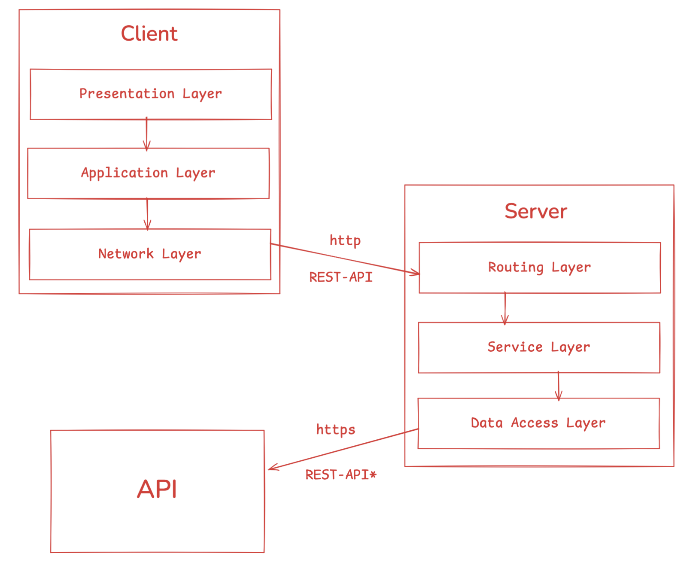
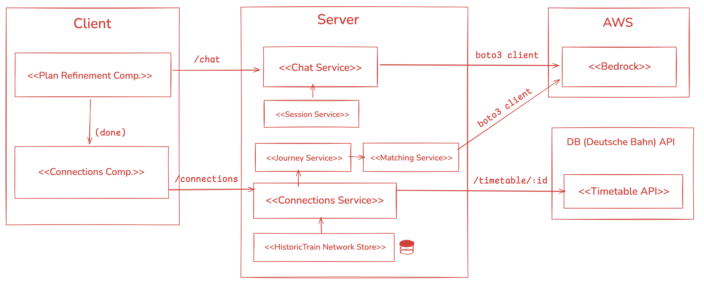

# Plan Bahn - Travel Smarter 🚆

Plan Bahn is an AI-powered travel assistant that transforms the way you experience Deutsche Bahn journeys. By leveraging real-time timetable data and intelligent routing, we help you discover scenic routes, avoid overcrowded trains, and make your journey as enjoyable as your destination.

#### The Problem

Deutsche Bahn passengers face daily challenges: unreliable connections, overcrowded trains, and last-minute cancellations that disrupt travel plans. Traditional journey planners focus solely on getting you from A to B as quickly as possible, ignoring the quality of the journey itself. Travelers are left scrambling when delays cascade through their connections, with no insight into which alternative routes might offer a better, more comfortable, or more scenic experience.

#### Our Solution

Plan Bahn combines real-time Deutsche Bahn timetable data with an AI agent that understands your travel preferences and constraints. Our intelligent assistant monitors live departure boards, analyzes train occupancy, identifies scenic routes, and proactively suggests alternatives when delays occur. Instead of just showing you the fastest route, we help you find the journey that best balances speed, comfort, reliability, and experience—making the journey itself part of the adventure.


## Architecture

Plan Bahn follows a modern **layered architecture** that separates concerns and enables scalable, maintainable development:

### System Overview




// TODO: FIX AND ADAPT
Our architecture consists of three primary layers:

1. **Presentation Layer (Frontend)** - Vue 3 application providing an intuitive user interface for travel planning and interaction with the AI assistant

2. **Application Layer (Backend API)** - FastAPI service that orchestrates business logic, manages sessions, and exposes REST endpoints for frontend consumption

3. **Data & Integration Layer** - Handles external API integration with Deutsche Bahn Timetables API and AWS Bedrock for AI capabilities

### Component Architecture



// TODO: FIX AND ADAPT
Each layer is further decomposed into specialized subsystems:

- **Agent System**: LangGraph-based AI orchestration with tool-calling capabilities
- **Service Layer**: Business logic for connections, travel planning, and simulation
- **Data Access Layer**: Abstracted interfaces for DB API and AWS Bedrock services
- **Model Layer**: Pydantic schemas ensuring type safety and validation across the stack

This separation enables independent development, testing, and scaling of each component while maintaining clear interfaces between layers.


## Local Deployment

The entire application stack can be run locally using Docker Compose, which is a tool for defining and running multi-container Docker applications with a single command.

### Prerequisites

<details>
<summary>Installing Docker Compose (click to expand)</summary>

Docker Compose is included with Docker Desktop for Mac and Windows. For Linux:

```bash
# Install Docker Compose
sudo curl -L "https://github.com/docker/compose/releases/latest/download/docker-compose-$(uname -s)-$(uname -m)" -o /usr/local/bin/docker-compose
sudo chmod +x /usr/local/bin/docker-compose

# Verify installation
docker-compose --version
```

For other installation methods, visit the [official Docker Compose documentation](https://docs.docker.com/compose/install/).
</details>

### Environment Variables

Before running the application, you need to configure environment variables for API access and AWS services. Create a `.env` file in the `server/` directory based on the provided template:

```bash
cp server/.env.example server/.env
```

Then edit `server/.env` and fill in the following required variables:

- **`TROY_CLIENT_ID`** and **`TROY_API_KEY`**: Deutsche Bahn API credentials for timetable access
- **`LARS_CLIENT_ID`** and **`LARS_API_KEY`**: Alternative API credentials (if applicable)
- **`AWS_SHORT_TERM_KEY`**: Short-term AWS Bedrock token for fallback HTTP header authentication
- **`AWS_ACCESS_KEY`** and **`AWS_SECRET`**: Long-term AWS credentials. Can be obtained under AWS IAM -> User
- **`AWS_REGION`**: AWS region (default: `eu-central-1`)

See `server/.env.example` for the exact variable names and format.

### Running the Application

Once your environment variables are configured, start the entire stack with:

```bash
docker-compose up --build
```

This will build and start both services:

- **Frontend (Client)**: Available at [http://localhost:3000](http://localhost:3000)
- **Backend (Server)**: API available at [http://localhost:8000](http://localhost:8000)

### Verifying the Setup

To confirm everything is working correctly:

1. **Check the frontend**: Open [http://localhost:3000](http://localhost:3000) in your browser
2. **Check the API health**: Visit [http://localhost:8000/api/v1/status](http://localhost:8000/api/v1/status)
3. **View API documentation**: Navigate to [http://localhost:8000/docs](http://localhost:8000/docs) for interactive API docs

### Stopping the Application

To stop all services:

```bash
docker-compose down
```


## Development

For local development without Docker, you can run the client and server independently with hot-reloading for faster iteration.

### Client

The frontend is built with **Vue 3**, **Vuetify** (Material Design component framework), and **Vite** as the build tool. It provides a modern, responsive interface for interacting with the travel assistant.

#### Setup

1. **Install Node.js and npm**: Ensure you have Node.js 16+ installed
2. **Navigate to the client directory**:
   ```bash
   cd client
   ```
3. **Install dependencies**:
   ```bash
   npm install
   ```

#### Development Workflow

Start the development server with hot-module replacement:

```bash
npm run dev
```

The application will be available at [http://localhost:3000](http://localhost:3000) and will automatically reload when you make changes to the source files.

#### Other Commands

- **Build for production**: `npm run build`
- **Preview production build**: `npm run preview`
- **Lint and fix code**: `npm run lint`

### Server

The backend is a **FastAPI** application written in Python, using **LangGraph** and **LangChain** for AI agent orchestration, with AWS Bedrock for language model inference. It provides REST API endpoints for real-time train data and intelligent travel assistance.

#### Setup

1. **Install uv**: We use [uv](https://github.com/astral-sh/uv) as our Python package manager for fast, reliable dependency management:
   ```bash
   # macOS/Linux
   curl -LsSf https://astral.sh/uv/install.sh | sh
   
   # Or with pip
   pip install uv
   ```

2. **Navigate to the server directory**:
   ```bash
   cd server
   ```

3. **Sync dependencies**: Install all project dependencies defined in `pyproject.toml`:
   ```bash
   uv sync
   ```

4. **Configure environment variables**: Copy and edit the `.env` file as described in the Local Deployment section above.

#### Development Workflow

Run the development server with auto-reload:

```bash
uv run uvicorn server.main:app --reload --host 0.0.0.0 --port 8000
```

The API will be available at [http://localhost:8000](http://localhost:8000), and FastAPI's interactive documentation will be at [http://localhost:8000/docs](http://localhost:8000/docs).

#### Working with Dependencies

- **Add a new package**: `uv add package-name`
- **Add a development dependency**: `uv add --dev package-name`
- **Update dependencies**: `uv sync`
- **Remove a package**: `uv remove package-name`


## API Architecture

The backend exposes a RESTful API that the frontend communicates with to provide intelligent travel assistance. All endpoints are prefixed with `/api/v1` and are documented with OpenAPI/Swagger.

### Core Endpoints

#### Chat & AI Assistant

- **POST `/api/v1/chat`**
  - **Purpose**: Send messages to the AI travel assistant
  - **Request Body**: 
    ```json
    {
      "message": "Find me a scenic route from Munich to Berlin"
    }
    ```
  - **Headers**: `X-Session-Id` (optional) - for maintaining conversation context
  - **Response**: 
    ```json
    {
      "session_id": "uuid",
      "message": "AI assistant response"
    }
    ```
  - **Description**: Processes natural language queries about travel planning, routes, delays, and alternatives using a LangGraph ReAct agent with access to live train data

#### Travel & Station Information

- **GET `/api/v1/stations`**
  - **Purpose**: List all available stations
  - **Response**: Array of station names with their EVA numbers

- **GET `/api/v1/live/{station_name}`**
  - **Purpose**: Get real-time departure board for a specific station
  - **Parameters**: `station_name` - Name of the station (e.g., "München Hbf")
  - **Response**: Live departure data including train numbers, times, platforms, and delays

- **GET `/api/v1/status`**
  - **Purpose**: Health check for all backend services
  - **Response**: Service status indicators

- **GET `/api/v1/status/ticker`**
  - **Purpose**: Get current system messages and alerts
  - **Response**: Array of status messages for the ticker display

#### Connections & Journey Planning

- **POST `/api/v1/connections`**
  - **Purpose**: Search for train connections between stations
  - **Request Body**:
    ```json
    {
      "from": "München Hbf",
      "to": "Berlin Hbf",
      "departure_time": "2024-12-07T14:30:00Z",
      "preferences": {
        "scenic": true,
        "avoid_crowded": true
      }
    }
    ```
  - **Response**: Array of journey options with connections, transfers, and recommendations

### Interactive API Documentation

When running the server, visit [http://localhost:8000/docs](http://localhost:8000/docs) to access the auto-generated Swagger UI, where you can explore all endpoints, view request/response schemas, and test API calls directly in your browser.

### Authentication

API authentication for Deutsche Bahn services is handled server-side using credentials from the `.env` file. The frontend does not need to manage API keys—all external API calls are proxied through the backend.

---

## Project Structure

```
msg-code-create/
├── client/               # Vue 3 frontend application
│   ├── src/
│   │   ├── components/  # Reusable Vue components
│   │   ├── pages/       # Route pages
│   │   ├── stores/      # Pinia state management
│   │   └── router/      # Vue Router configuration
│   └── package.json
│
├── server/              # FastAPI backend application
│   ├── agent/          # LangGraph AI agent implementation
│   ├── data_access/    # Database and API clients
│   ├── models/         # Pydantic data models
│   ├── routes/         # API route handlers
│   ├── service/        # Business logic layer
│   └── pyproject.toml
│
├── scripts/            # Utility scripts for data ingestion
├── compose.yaml        # Docker Compose configuration
└── README.md
```

## Technologies Used

### Frontend
- **Vue 3** - Progressive JavaScript framework
- **Vuetify** - Material Design component library
- **Vite** - Next-generation frontend tooling
- **Pinia** - State management
- **Axios** - HTTP client

### Backend
- **FastAPI** - Modern Python web framework
- **LangGraph** - Agentic AI workflow orchestration
- **LangChain** - LLM application framework
- **AWS Bedrock** - Managed AI model inference
- **Uvicorn** - ASGI server
- **Pydantic** - Data validation

### Infrastructure
- **Docker & Docker Compose** - Containerization
- **Deutsche Bahn Timetables API** - Real-time train data

## License

This project is licensed under the terms specified in the [LICENSE](LICENSE) file.

---

**Made with ❤️ for better train journeys**
