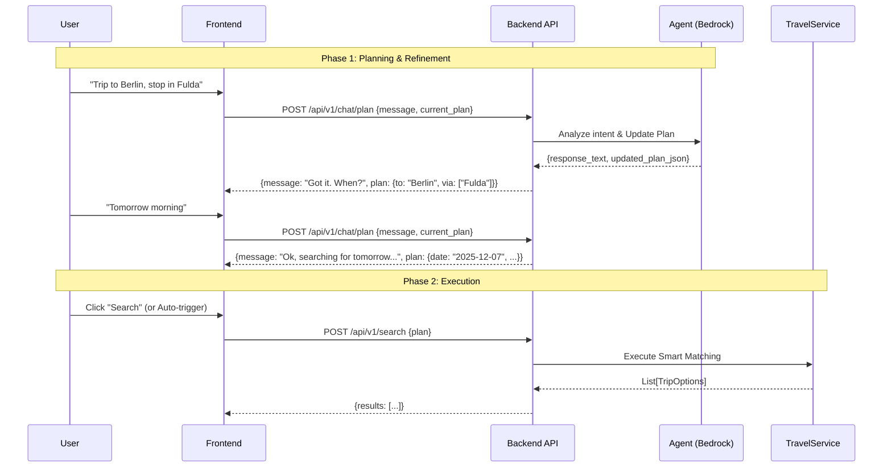

# API Specification & Frontend Alignment

> **Goal**: Define the contract between the Frontend (React) and Backend (FastAPI + Agent) to support a conversational travel planner that evolves into a concrete search execution.

## 1. High-Level Flow

The interaction follows a "Refinement Loop" pattern:
1.  **Chat Phase**: User talks to the AI to define their intent (e.g., "I want to go to Berlin with a stop in Fulda").
2.  **Plan State**: The backend maintains a structured "Travel Plan" that evolves with every message.
3.  **Execution Phase**: Once the user is satisfied, the Frontend triggers the search using the finalized Plan.



---

## 2. Data Models

### The "Travel Plan" (Shared State)
This JSON object is passed back and forth during the chat.

```typescript
interface TravelPlan {
  origin: string | null;          // e.g. "München Hbf"
  destination: string | null;     // e.g. "Berlin Hbf"
  via: string[];                  // e.g. ["Fulda"]
  date: string | null;            // ISO Date "2025-12-07"
  time: string | null;            // "10:00"
  preferences: {
    maxChanges?: number;
    accessibility?: boolean;      // "Step-free"
    bike?: boolean;
  };
  isReady: boolean;               // True if minimum fields are present
}
```

### The "Journey" (Search Result)
The options presented to the user.

```typescript
interface Journey {
  journeyId: string;              // Unique ID
  totalTime: number;              // Duration in minutes
  changes: string[];              // List of transfer stations e.g. ["Fulda", "Kassel"]
  aiInsight: string;              // e.g. "Fastest connection, but tight transfer in Fulda."
  trains: {
    name: string;                 // "ICE 690"
    direction: string;
    platform: string;             // "Track 4" (Planned)
    origin: string;
    destination: string;
    departureTime: string;        // ISO
    arrivalTime: string;          // ISO
  }[];
}
```

---

## 3. Endpoints

### 3.1 Chat & Plan Refinement
**POST** `/api/v1/chat`

*   **Description**: Unified endpoint for chatting and plan building.
*   **Request**:
    ```json
    {
      "message": "I want to go to Berlin tomorrow",
      "session_id": "optional-uuid",
      "current_plan": { ... }
    }
    ```
*   **Response**:
    ```json
    {
      "session_id": "uuid",
      "message": "Ok, what time?",
      "plan": { 
        "origin": "Munich", 
        "destination": "Berlin", 
        "date": "2025-12-07",
        "isReady": false 
      }
    }
    ```

### 3.2 Execute Search
**POST** `/api/v1/search`

*   **Description**: Executes the search using the **3-Step Logic** (Discover -> Get Trains -> Smart Linker).
*   **Request**:
    ```json
    {
      "plan": { ... } // The finalized TravelPlan
    }
    ```
*   **Response**:
    ```json
    {
      "journeys": [
        {
          "journeyId": "j_123",
          "totalTime": 270,
          "changes": ["Fulda"],
          "aiInsight": "Reliable connection with 30min buffer.",
          "trains": [
            { 
              "name": "ICE 690", 
              "origin": "Munich", 
              "destination": "Fulda",
              "platform": "4",
              "departureTime": "10:00",
              "arrivalTime": "12:30"
            },
            { 
              "name": "ICE 372", 
              "origin": "Fulda", 
              "destination": "Berlin",
              "platform": "8",
              "departureTime": "13:00",
              "arrivalTime": "14:30"
            }
          ]
        }
      ]
    }
    ```
