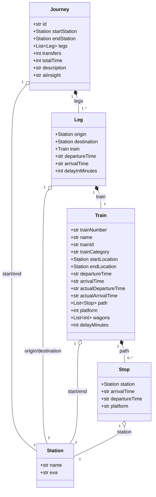

# Data Models

> Pydantic models used throughout the Smart Travel Assistant.

## Model Hierarchy



---

## Core Models

### Journey

The top-level response object representing a complete travel itinerary.

**Location:** `server/models/journey.py`

| Field | Type | Description |
|-------|------|-------------|
| `id` | `str` | Unique UUID for this journey |
| `startStation` | `Station` | Origin station |
| `endStation` | `Station` | Destination station |
| `legs` | `List[Leg]` | Ordered list of train segments |
| `transfers` | `int` | Number of transfers (legs - 1) |
| `totalTime` | `int` | Total duration in minutes |
| `description` | `str` | Human-readable summary (e.g., "Direct", "1 Transfer") |
| `aiInsight` | `str?` | AI-generated travel advice |

**Example:**
```json
{
  "id": "550e8400-e29b-41d4-a716-446655440000",
  "startStation": {"name": "Frankfurt (Main) Hbf", "eva": "8000105"},
  "endStation": {"name": "München Hbf", "eva": "8000261"},
  "legs": [...],
  "transfers": 0,
  "totalTime": 260,
  "description": "Direct",
  "aiInsight": "Direct ICE connection, typically punctual."
}
```

---

### Leg

A single segment of a journey on one train.

**Location:** `server/models/leg.py`

| Field | Type | Description |
|-------|------|-------------|
| `origin` | `Station` | Boarding station |
| `destination` | `Station` | Alighting station |
| `train` | `Train` | Train details |
| `departureTime` | `str` | Scheduled departure (HH:MM:SS) |
| `arrivalTime` | `str` | Scheduled arrival (HH:MM:SS) |
| `delayInMinutes` | `int` | Expected delay (default: 0) |

**Example:**
```json
{
  "origin": {"name": "Frankfurt (Main) Hbf", "eva": "8000105"},
  "destination": {"name": "Mannheim Hbf", "eva": "8000244"},
  "train": {...},
  "departureTime": "10:00:00",
  "arrivalTime": "10:30:00",
  "delayInMinutes": 5
}
```

---

### Train

Details about a specific train service.

**Location:** `server/models/train.py`

| Field | Type | Description |
|-------|------|-------------|
| `trainNumber` | `str` | Train number (e.g., "690") |
| `name` | `str` | Display name (e.g., "ICE 690") |
| `trainId` | `str?` | Internal GTFS trip ID |
| `trainCategory` | `str?` | Category (ICE, IC, RE, RB, S) |
| `startLocation` | `Station` | Train origin (full route) |
| `endLocation` | `Station` | Train terminus (full route) |
| `departureTime` | `str/datetime?` | Scheduled departure |
| `arrivalTime` | `str/datetime?` | Scheduled arrival |
| `actualDepartureTime` | `str/datetime?` | Real-time departure |
| `actualArrivalTime` | `str/datetime?` | Real-time arrival |
| `path` | `List[Stop]` | Intermediate stops |
| `platform` | `int?` | Departure platform |
| `wagons` | `List[int]` | Wagon sequence |
| `delayMinutes` | `int` | Current delay |

**Train Categories:**
| Category | Full Name | Description |
|----------|-----------|-------------|
| ICE | InterCity Express | High-speed long distance |
| IC | InterCity | Long distance |
| RE | Regional Express | Fast regional |
| RB | Regionalbahn | Regional |
| S | S-Bahn | Urban rail |

**Example:**
```json
{
  "trainNumber": "690",
  "name": "ICE 690",
  "trainCategory": "ICE",
  "startLocation": {"name": "Hamburg Hbf", "eva": "8000001"},
  "endLocation": {"name": "München Hbf", "eva": "8000261"},
  "departureTime": "10:00:00",
  "arrivalTime": "14:20:00",
  "path": [...],
  "platform": 7,
  "delayMinutes": 5
}
```

---

### Station

A train station identifier.

**Location:** `server/models/station.py`

| Field | Type | Description |
|-------|------|-------------|
| `name` | `str` | Station display name |
| `eva` | `str` | EVA ID (German station code) |

**EVA ID Format:**
- 7-digit numeric code (e.g., "8000105")
- Uniquely identifies each station in the DB network
- Used by all German rail APIs

**Example:**
```json
{
  "name": "Frankfurt (Main) Hbf",
  "eva": "8000105"
}
```

**Major Station EVAs:**
| Station | EVA ID |
|---------|--------|
| Frankfurt (Main) Hbf | 8000105 |
| München Hbf | 8000261 |
| Berlin Hbf | 8011160 |
| Hamburg Hbf | 8002549 |
| Köln Hbf | 8000207 |

---

### Stop

An intermediate stop on a train's route.

**Location:** `server/models/stop.py`

| Field | Type | Description |
|-------|------|-------------|
| `station` | `Station` | Stop location |
| `arrivalTime` | `str?` | Scheduled arrival (HH:MM:SS) |
| `departureTime` | `str?` | Scheduled departure (HH:MM:SS) |
| `platform` | `str?` | Platform number |

**Example:**
```json
{
  "station": {"name": "Mannheim Hbf", "eva": "8000244"},
  "arrivalTime": "10:28:00",
  "departureTime": "10:30:00",
  "platform": "3"
}
```

---

## API Request/Response Models

### ConnectionsRequest

**Location:** `server/models/connection_schema.py`

```python
class ConnectionsRequest(BaseModel):
    start: str              # Origin station name
    end: str                # Destination station name
    trip_plan: str = ""     # Optional preferences
    departure_time: Optional[datetime] = None
```

### ConnectionsResponse

```python
class ConnectionsResponse(BaseModel):
    journeys: List[Journey]
```

---

## Time Format Notes

**Time Strings:**
- Format: `HH:MM:SS` (24-hour)
- GTFS allows hours > 24 for next-day times (e.g., "25:30:00" = 1:30 AM)
- System handles midnight crossing automatically

**Duration:**
- Always in minutes (integer)
- Calculated as: `(arrival - departure).total_seconds() / 60`

---

## File Locations

| Model | File |
|-------|------|
| Journey | `server/models/journey.py` |
| Leg | `server/models/leg.py` |
| Train | `server/models/train.py` |
| Station | `server/models/station.py` |
| Stop | `server/models/stop.py` |
| ConnectionsRequest/Response | `server/models/connection_schema.py` |
| All exports | `server/models/__init__.py` |
