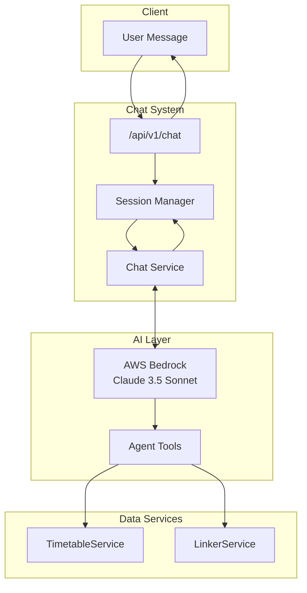
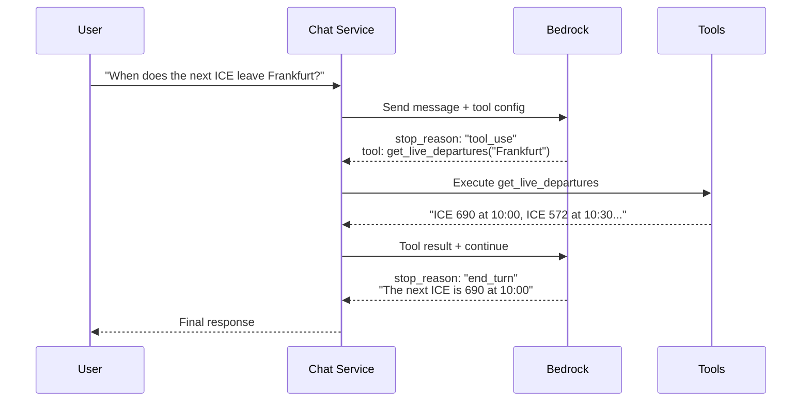

# AI Agent System

> How the chat agent works, including LangGraph, Bedrock integration, and tool execution.

## Overview

The Smart Travel Assistant uses an AI-powered chat system for conversational travel planning. The system is built on:

- **AWS Bedrock** - LLM provider (Claude 3.5 Sonnet)
- **LangGraph** - Agent framework with ReAct pattern
- **Session Management** - In-memory conversation history



---

## Chat Endpoint

**Route:** `POST /api/v1/chat`

**Location:** `server/routes/chat.py`

### Request

```http
POST /api/v1/chat
Content-Type: application/json
X-Session-Id: 550e8400-e29b-41d4-a716-446655440000  # Optional

{
  "message": "I want to travel from Berlin to Munich tomorrow"
}
```

### Response

```json
{
  "session_id": "550e8400-e29b-41d4-a716-446655440000",
  "message": "What time would you like to depart?"
}
```

### Session Management

**Location:** `server/service/session_manager.py`

| Setting | Value | Description |
|---------|-------|-------------|
| `session_ttl_hours` | 1 | Sessions expire after 1 hour of inactivity |
| `max_messages` | 10 | Keeps last 10 messages per session |
| Storage | In-memory | Not persisted across restarts |

```python
class SessionManager:
    def get_or_create_session(session_id: str) -> Session
    def add_message(session_id: str, role: str, content: str)
    def get_history(session_id: str) -> List[Message]
```

---

## Bedrock Integration

**Location:** `server/data_access/AWS/bedrock_service.py`

### Configuration

```python
# server/data_access/AWS/config.py
MODEL_ID = "eu.anthropic.claude-3-5-sonnet-20240620-v1:0"
MAX_TOKENS = 2048
TEMPERATURE = 0.3
```

### Authentication Methods

**Option 1: Long-term credentials (boto3)**
```python
client = boto3.client(
    "bedrock-runtime",
    aws_access_key_id=AWS_ACCESS_KEY,
    aws_secret_access_key=AWS_SECRET,
    region_name=AWS_REGION
)
```

**Option 2: Short-term bearer token**
```python
headers = {
    "Authorization": f"Bearer {AWS_SHORT_TERM_KEY}",
    "Content-Type": "application/json"
}
# Direct HTTP call to Bedrock endpoint
```

### BedrockService Methods

```python
class BedrockService:
    def send_message(
        message: str,
        system_prompt: str,
        conversation_history: List = [],
        tool_config: dict = None
    ) -> dict:
        """
        Returns:
        {
            "text": "AI response",
            "stop_reason": "end_turn" | "tool_use",
            "tool_requests": [...]  # If stop_reason == tool_use
        }
        """
```

---

## Agent Tools

**Location:** `server/agent/tools.py`

The agent has access to two tools for retrieving live train data:

### get_live_departures

```python
@tool
def get_live_departures(station_name: str) -> str:
    """
    Get live departure information for a train station.

    Returns next 10 departures with:
    - Train number and category
    - Destination
    - Scheduled and actual departure times
    - Platform (with changes)
    - Current delay
    """
```

**Example Output:**
```
Departures from Frankfurt (Main) Hbf:
1. ICE 690 to München Hbf - 10:00 (Delay: 5 min) - Platform 7
2. RE 50 to Mannheim Hbf - 10:15 (On time) - Platform 12
...
```

### get_train_details

```python
@tool
def get_train_details(train_category: str, train_number: str) -> str:
    """
    Get detailed information about a specific train.

    Returns:
    - All stops with arrival/departure times
    - Platform at each stop
    - Wheelchair accessibility
    - Current delays
    """
```

**Example Output:**
```
ICE 690 (Hamburg → München):
1. Hamburg Hbf - Dep 06:30 - Platform 8
2. Hannover Hbf - Arr 07:45, Dep 07:48 - Platform 5
3. Frankfurt (Main) Hbf - Arr 10:00, Dep 10:05 - Platform 7
...
Wheelchair accessible: Yes
```

---

## Tool Execution Loop

**Location:** `server/service/chat.py`

The chat service implements a tool-use loop allowing the AI to call tools and reason over results:



### Implementation

```python
# Max 3 turns of tool execution
for turn_count in range(3):
    response = bedrock.send_message(
        message=current_message,
        conversation_history=history,
        tool_config={"tools": TOOLS}
    )

    if response["stop_reason"] == "tool_use":
        # Execute requested tools
        for tool_req in response["tool_requests"]:
            result = execute_tool(tool_req["name"], tool_req["input"])
            tool_results.append(result)

        # Feed results back to LLM
        current_message = f"Tool results: {tool_results}"
    else:
        # Final response
        return response["text"]
```

---

## System Prompt

**Location:** `server/data_access/AWS/config.py`

The system prompt configures the AI's behavior:

```python
DEFAULT_SYSTEM_PROMPT = """
You are a travel REQUIREMENTS clarification assistant.
Your job is to ask questions to extract concrete, specific details
from users about their travel needs.

Guidelines:
- Ask about departure time, date, and preferences
- Clarify vague terms like "morning" or "fast"
- Confirm station names for ambiguous cities
- Ask about accessibility needs if mentioned
- Your response should end with a question mark

When requirements are complete, summarize and confirm.
"""
```

---

## LangGraph Agent (Alternative)

**Location:** `server/agent/core.py`

An alternative agent implementation using LangGraph's ReAct pattern:

```python
from langgraph.prebuilt import create_react_agent

# Model options
MODEL_ID = "anthropic.claude-3-haiku-20240307-v1:0"  # Fast
# MODEL_ID = "meta.llama3-2-1b-instruct-v1:0"        # Alternative

# Create agent with tools
tools = [get_live_departures, get_train_details]
agent = create_react_agent(llm, tools, prompt=system_prompt)

# Run agent
result = agent.invoke({"messages": [HumanMessage(content=user_input)]})
```

**Note:** The LangGraph agent is available but the main chat endpoint uses the direct Bedrock service with manual tool execution for more control.

---

## Key Files

| File | Purpose |
|------|---------|
| `server/routes/chat.py` | Chat endpoint |
| `server/service/chat.py` | Chat logic with tool-use loop |
| `server/service/session_manager.py` | Session management |
| `server/agent/core.py` | LangGraph agent |
| `server/agent/tools.py` | Tool definitions |
| `server/data_access/AWS/bedrock_service.py` | Bedrock client |
| `server/data_access/AWS/config.py` | AI configuration |

---

## Current Limitations

| Limitation | Description |
|------------|-------------|
| In-memory sessions | Sessions lost on server restart |
| 3-turn limit | Max 3 tool executions per message |
| No journey planning | Agent can query data but not plan routes |
| Clarification focus | System prompt enforces question-asking behavior |

---

## Future Improvements

From [ROADMAP.md](../../ROADMAP.md):

1. **Redis sessions** - Persist conversations across restarts
2. **Journey planning tool** - Let agent call JourneyService directly
3. **Multi-modal** - Support voice input/output
4. **Streaming** - Stream responses for better UX
