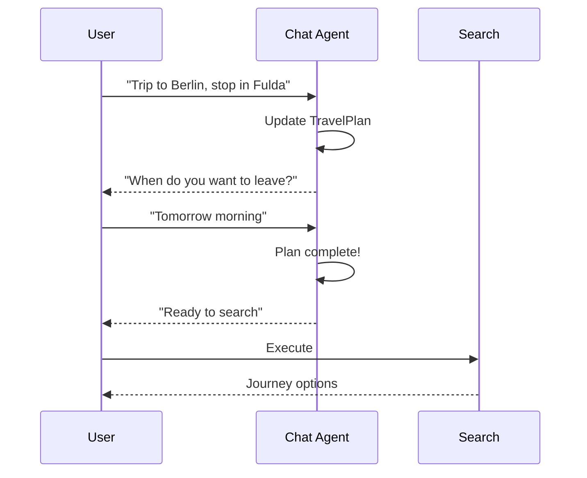
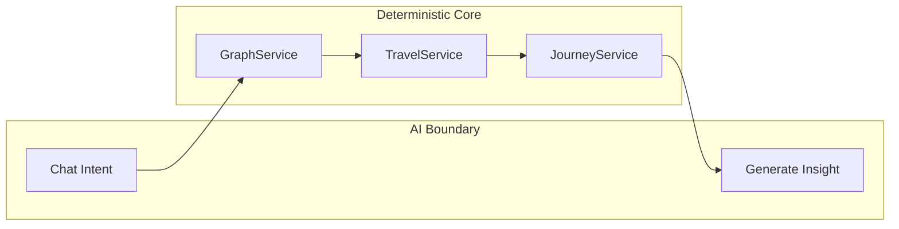
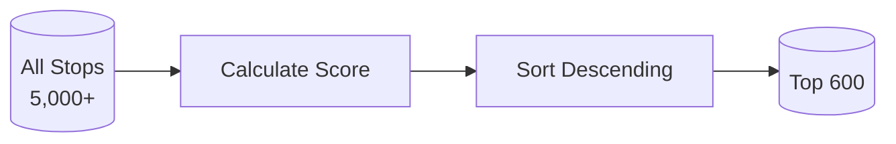
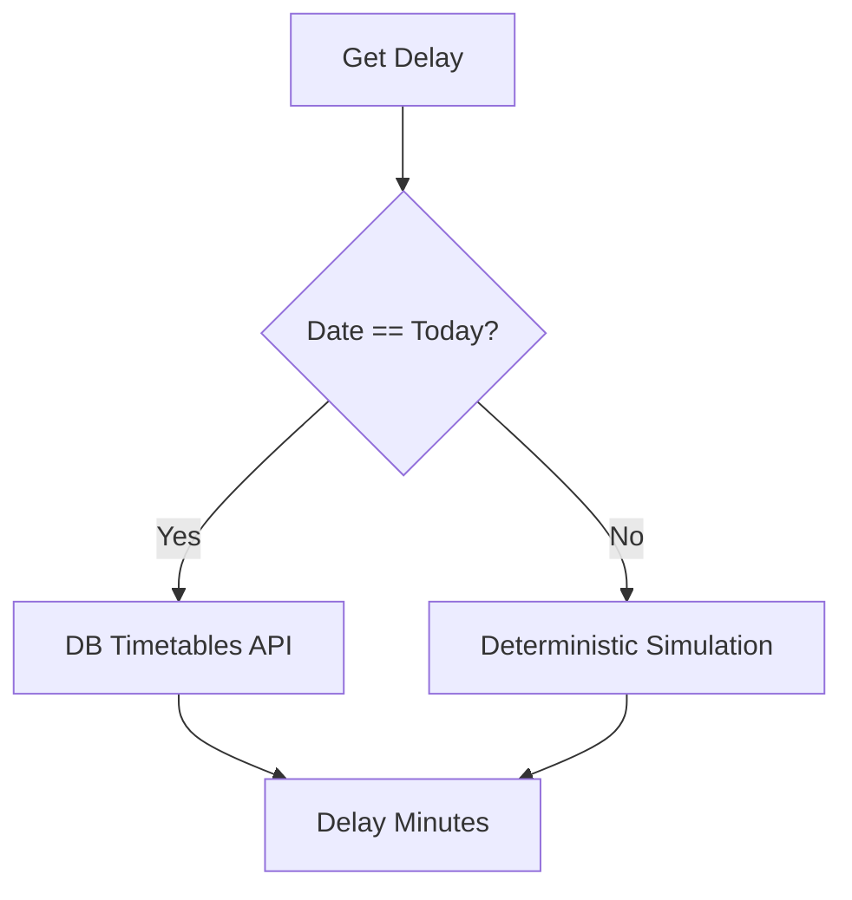

# Architecture Decision Records (ADRs)

> Key architectural decisions made during development, with rationale and consequences.

---

## ADR-001: Chat-First Flow

### Context
Traditional travel planners use a search-first approach: user fills a form, clicks search, gets results. This fails for complex requests like "I want to stop somewhere nice on the way" or "I need step-free access."

### Decision
Implement a **Chat-First** flow where users talk to an AI to build a structured `TravelPlan` before executing any database queries.

### Flow


### Consequences
- **Positive**: Complex intents understood before expensive queries
- **Positive**: Natural conversation feels easier than forms
- **Negative**: Requires AI infrastructure (Bedrock)
- **Negative**: Slower for simple "A to B" queries

---

## ADR-002: Service-First + AI-Last

### Context
AI agents can be powerful but are unpredictable, slow, and expensive. We could let the agent handle everything, or minimize AI involvement.

### Decision
Use AI only at system **boundaries**:
1. **Intent understanding** (chat phase)
2. **Journey evaluation** (insight generation)

All core logic (routing, queries, validation) is deterministic Python code.



### Consequences
- **Positive**: Predictable, debuggable, testable
- **Positive**: Fast (no AI calls in hot path)
- **Positive**: Cheaper (fewer LLM tokens)
- **Negative**: Less flexible than pure agent approach
- **Negative**: AI insights add latency to final response

---

## ADR-003: Static Graph for Routing

### Context
Production routing systems (HAFAS, Google Transit) use time-dependent algorithms like CSA or Raptor that consider actual departure times.

### Decision
For MVP, use a **pre-computed static graph** with NetworkX:
- Nodes: Top 600 stations by connectivity
- Edges: Weighted by minimum travel time
- Algorithm: Dijkstra + k-shortest paths

### Trade-offs

| Approach | Pros | Cons |
|----------|------|------|
| Static Graph | Fast, simple, good enough | Doesn't know when trains run |
| CSA | Time-aware, accurate | Complex, slow on large data |
| Raptor | Multi-criteria | Very complex to implement |

### Consequences
- **Positive**: Graph fits in memory (~2MB)
- **Positive**: Pathfinding in <10ms
- **Negative**: May suggest impossible transfers (train doesn't run at that time)
- **Negative**: Future migration to CSA/Raptor required for production

---

## ADR-004: Top 600 Stations Heuristic

### Context
GTFS contains 5,000+ stops including bus stops, platforms, and minor stations. Including all would create a massive, slow graph.

### Decision
Pre-compute a **connectivity score** for each station and select the top ~600 for the graph.

**Score Formula:**
```
connectivity = departures × unique_destinations
```

### Selection Process


### Consequences
- **Positive**: Graph stays small and fast
- **Positive**: Major hubs always included
- **Negative**: Small stations can't be transfer points
- **Negative**: Some valid routes may be missed

---

## ADR-005: 5-Minute Transfer Buffer

### Context
Transfers need time for passengers to walk between platforms. The right buffer depends on station size, platform distance, and passenger mobility.

### Decision
Use a **fixed 5-minute minimum** for all transfers in MVP.

### Future Improvements
| Scenario | Target Buffer |
|----------|---------------|
| Same platform | 2 min |
| Same station | 5-7 min |
| Different station parts | 10+ min |
| Accessibility needs | +5 min |

### Consequences
- **Positive**: Simple, conservative
- **Negative**: May reject valid tight connections
- **Negative**: May accept impossible cross-station transfers

---

## ADR-006: Delay Simulation Strategy

### Context
We need delay information for future dates, but:
- Live API only works for "today"
- No historical delay database (yet)
- Calendar tables missing from GTFS

### Decision
Implement **hybrid delay handling**:



**Simulation Logic:**
```python
def get_delay(train_number):
    hash_value = hash(train_number)
    if hash_value % 10 == 0:  # 10% chance
        return (hash_value % 15) + 1  # 1-15 min delay
    return 0
```

### Consequences
- **Positive**: Demo always works with realistic-looking data
- **Positive**: Same input = same output (deterministic)
- **Negative**: Not statistically accurate
- **Future**: Integrate `piebro/deutsche-bahn-data` for real patterns

---

## ADR-007: SQLite for GTFS Storage

### Context
GTFS data (~500K stop_times) needs fast querying. Options: PostgreSQL, SQLite, in-memory.

### Decision
Use **SQLite** embedded database.

### Consequences
- **Positive**: Zero setup, single file
- **Positive**: Fast enough for read-heavy workload
- **Positive**: Easy to ship with Docker
- **Negative**: Single-writer limitation (not an issue for read-only GTFS)
- **Negative**: No advanced features (full-text search, PostGIS)

---

## ADR-008: AWS Bedrock for AI

### Context
Need LLM for chat and insights. Options: OpenAI, local models, AWS Bedrock.

### Decision
Use **AWS Bedrock** with Claude/Llama models.

### Consequences
- **Positive**: Enterprise-grade, scalable
- **Positive**: Multiple model options
- **Negative**: AWS authentication complexity
- **Negative**: Latency (~500-1000ms per call)
- **Negative**: Cost per token

---

## Summary Table

| ADR | Decision | Status |
|-----|----------|--------|
| 001 | Chat-First Flow | Implemented |
| 002 | Service-First + AI-Last | Implemented |
| 003 | Static Graph Routing | Implemented |
| 004 | Top 600 Stations | Implemented |
| 005 | 5-Minute Transfer Buffer | Implemented |
| 006 | Hybrid Delay Simulation | Implemented |
| 007 | SQLite for GTFS | Implemented |
| 008 | AWS Bedrock for AI | Implemented |
