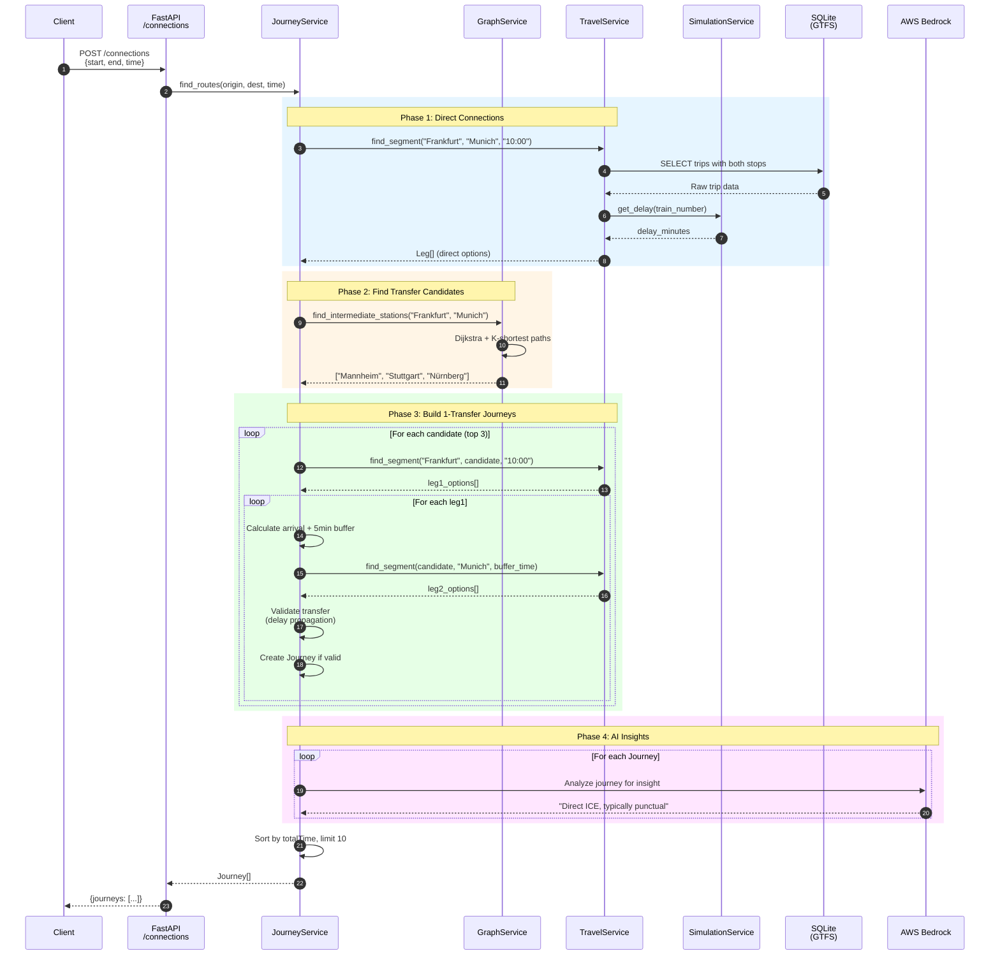
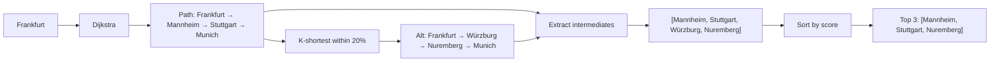

# Request Data Flow

> A complete trace of how a connections request flows through the system.

## Overview

This document traces a journey search request from the API endpoint through all services, showing exactly how the system finds and returns train connections.

---

## Example Request

```http
POST /api/v1/connections
Content-Type: application/json

{
  "start": "Frankfurt (Main) Hbf",
  "end": "München Hbf",
  "departure_time": "2025-12-07T10:00:00"
}
```

---

## Complete Request Flow



---

## Phase 1: Direct Connections

**Goal:** Find trains that go directly from origin to destination.

### TravelService.find_segment()

```python
def find_segment(origin: str, destination: str, time: str) -> List[Leg]:
    # 1. Resolve station names to all matching stop_ids
    origin_ids = get_all_station_ids(origin)      # e.g., ["8000105", "8098105"]
    dest_ids = get_all_station_ids(destination)   # e.g., ["8000261", "8098261"]

    # 2. Query GTFS for matching trips
    # ... SQL query below ...

    # 3. Add delay info from SimulationService
    for leg in legs:
        leg.delayInMinutes = simulation.get_delay(leg.train.trainNumber)

    return legs
```

### SQL Query

```sql
SELECT
    t.trip_id,
    r.route_short_name,
    t.trip_short_name,
    st1.departure_time,
    st2.arrival_time,
    st1.stop_id AS origin_stop,
    st2.stop_id AS dest_stop
FROM stop_times st1
JOIN stop_times st2 ON st1.trip_id = st2.trip_id
JOIN trips t ON st1.trip_id = t.trip_id
JOIN routes r ON t.route_id = r.route_id
WHERE st1.stop_id IN (?, ?, ...)     -- Origin IDs
  AND st2.stop_id IN (?, ?, ...)     -- Destination IDs
  AND st1.stop_sequence < st2.stop_sequence  -- Same trip, correct order
  AND st1.departure_time >= ?        -- After requested time
ORDER BY st1.departure_time
LIMIT 10
```

**Output:** List of `Leg` objects with train details and scheduled times.

---

## Phase 2: Find Transfer Candidates

**Goal:** Identify major stations between origin and destination for potential transfers.

### GraphService.find_intermediate_stations()



**Output:** Top 3 candidate transfer stations, sorted by connectivity score.

---

## Phase 3: Build 1-Transfer Journeys

**Goal:** For each candidate station, find valid leg combinations.

### Algorithm

```python
for transfer_station in candidates[:3]:
    # Find Leg 1: Origin → Transfer
    leg1_options = travel_service.find_segment(origin, transfer_station, time)

    for leg1 in leg1_options:
        # Calculate minimum departure from transfer station
        arrival_at_transfer = parse_time(leg1.arrivalTime)
        buffer = timedelta(minutes=5)
        min_departure = arrival_at_transfer + buffer

        # Find Leg 2: Transfer → Destination
        leg2_options = travel_service.find_segment(
            transfer_station, destination, min_departure
        )

        for leg2 in leg2_options:
            # Delay Propagation Check
            real_arrival_l1 = arrival_at_transfer + timedelta(minutes=leg1.delayInMinutes)
            real_departure_l2 = parse_time(leg2.departureTime) + timedelta(minutes=leg2.delayInMinutes)

            # Is transfer still valid?
            if real_departure_l2 < real_arrival_l1 + buffer:
                continue  # Transfer broken by delay

            # Valid! Create journey
            journey = create_journey([leg1, leg2])
            journeys.append(journey)
```

### Delay Propagation Example

```
Leg 1: ICE 123 Frankfurt → Mannheim
  - Scheduled arrival: 10:30
  - Delay: 8 minutes
  - Real arrival: 10:38

Leg 2: ICE 456 Mannheim → Munich
  - Scheduled departure: 10:45
  - Delay: 0 minutes
  - Real departure: 10:45

Transfer check:
  - Need: 10:38 + 5 min = 10:43
  - Have: 10:45
  - Result: ✓ Valid (2 min buffer)
```

---

## Phase 4: AI Insight Generation

**Goal:** Add a human-readable summary to each journey.

### Bedrock Prompt

```python
prompt = f"""
Analyze this train journey and provide a short, helpful insight (max 1 sentence).
Focus on punctuality, comfort, and ease of transfer.

Journey Details:
- Total Time: {journey.totalTime} min
- Transfers: {journey.transfers}
- Legs:
  - ICE 123 from Frankfurt to Mannheim (Delay: 8 min)
  - ICE 456 from Mannheim to Munich (Delay: 0 min)

If there are delays > 5 min, warn the user.
If it's a direct connection, highlight the comfort.
If there are tight transfers, mention the risk.

Output ONLY the insight text.
"""
```

**Output:** `"Incoming train has 8-minute delay, but transfer buffer is sufficient."`

---

## Response Structure

```json
{
  "journeys": [
    {
      "id": "550e8400-e29b-41d4-a716-446655440000",
      "startStation": {
        "name": "Frankfurt (Main) Hbf",
        "eva": "8000105"
      },
      "endStation": {
        "name": "München Hbf",
        "eva": "8000261"
      },
      "legs": [
        {
          "origin": {"name": "Frankfurt (Main) Hbf", "eva": "8000105"},
          "destination": {"name": "München Hbf", "eva": "8000261"},
          "train": {
            "name": "ICE 690",
            "trainNumber": "690",
            "departureTime": "10:00:00",
            "arrivalTime": "14:20:00"
          },
          "departureTime": "10:00:00",
          "arrivalTime": "14:20:00",
          "delayInMinutes": 5
        }
      ],
      "transfers": 0,
      "totalTime": 260,
      "description": "Direct",
      "aiInsight": "Direct ICE connection with minor 5-minute delay."
    }
  ]
}
```

---

## Performance Characteristics

| Phase | Typical Duration | Notes |
|-------|------------------|-------|
| Direct connections | 50-100ms | Single SQL query |
| Graph pathfinding | 5-10ms | Pre-loaded in memory |
| 1-transfer search | 100-300ms | 3 candidates × 2 queries each |
| AI insight | 500-1000ms | Network call to Bedrock |
| **Total** | **700-1500ms** | Dominated by AI call |

---

## Error Handling

| Error | Handling |
|-------|----------|
| Station name not found | Return empty journeys array |
| No path in graph | Skip 1-transfer search, return direct only |
| Database query fails | Log error, return partial results |
| Bedrock timeout | Set `aiInsight = "AI Analysis unavailable."` |
| Invalid time format | Use 30-minute default duration |

---

## Key Files

| File | Responsibility |
|------|---------------|
| `server/routes/connections.py` | API endpoint handler |
| `server/service/journey_service.py` | Orchestration logic |
| `server/service/graph_service.py` | Pathfinding |
| `server/service/travel_service.py` | GTFS queries |
| `server/service/simulation.py` | Delay calculation |
| `server/data_access/AWS/bedrock_service.py` | AI calls |
