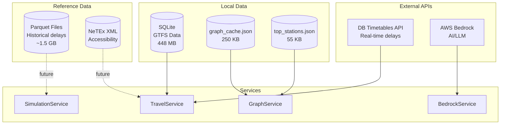
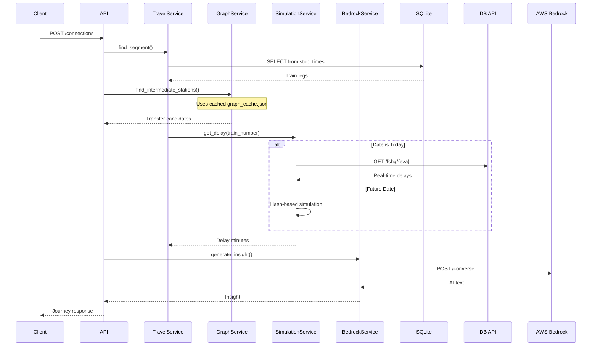

# Data Sources

> All local databases, external APIs, and data files used by the Smart Travel Assistant.

## Overview

The system combines multiple data sources to provide comprehensive travel planning:



---

## 1. Local Databases

### SQLite - GTFS Data

**Location:** `server/data/travel.db` (448 MB)

The primary data store containing German rail network schedules imported from GTFS.

**Connection:**
```python
# server/service/travel_service.py
DB_PATH = Path(__file__).parent.parent / "data" / "travel.db"
conn = sqlite3.connect(DB_PATH, check_same_thread=False)
```

**Tables:**

| Table | Records | Description |
|-------|---------|-------------|
| `stations` | ~5,000 | Stop metadata (name, coordinates, accessibility) |
| `routes` | ~2,000 | Route definitions (ICE, IC, RE, RB, S) |
| `trips` | ~50,000 | Individual train services |
| `stop_times` | ~500,000 | Arrival/departure times at each stop |
| `transfers` | ~1,000 | Connection rules between stops |
| `pathways` | ~500 | Walking paths within stations |
| `platforms` | ~2,000 | Platform metadata |

**Schema:**

```sql
-- Core tables
CREATE TABLE stations (
    stop_id TEXT PRIMARY KEY,
    stop_name TEXT,
    stop_lat REAL,
    stop_lon REAL,
    parent_station TEXT,
    wheelchair_boarding INTEGER
);

CREATE TABLE stop_times (
    trip_id TEXT,
    stop_id TEXT,
    arrival_time TEXT,      -- HH:MM:SS (can be >24:00)
    departure_time TEXT,
    stop_sequence INTEGER,
    PRIMARY KEY (trip_id, stop_sequence)
);

CREATE TABLE trips (
    trip_id TEXT PRIMARY KEY,
    route_id TEXT,
    service_id TEXT,
    trip_short_name TEXT,   -- Train number (e.g., "690")
    trip_headsign TEXT
);
```

**Indexes:**
```sql
CREATE INDEX idx_stop_times_trip ON stop_times(trip_id);
CREATE INDEX idx_stop_times_stop ON stop_times(stop_id);
CREATE INDEX idx_stop_times_departure ON stop_times(departure_time);
CREATE INDEX idx_stations_name ON stations(stop_name);
```

---

### JSON Cache Files

#### Graph Cache

**Location:** `server/data/graph_cache.json` (250 KB)

Pre-computed NetworkX graph serialized to JSON. Loaded on startup to avoid rebuilding from database.

```json
{
  "directed": true,
  "multigraph": false,
  "nodes": [
    {"id": "8000105", "name": "Frankfurt (Main) Hbf", "pos": [8.66, 50.11], "score": 2847}
  ],
  "links": [
    {"source": "8000105", "target": "8000244", "weight": 18}
  ]
}
```

**Rebuild:** Delete the file and restart server; takes ~2-3 minutes.

#### Top Stations

**Location:** `server/data/top_stations.json` (55 KB)

Pre-calculated connectivity scores for station ranking.

```json
[
  {"id": "8000105", "name": "Frankfurt (Main) Hbf", "score": 2847},
  {"id": "8000261", "name": "München Hbf", "score": 2156},
  ...
]
```

**Generation:** Run `scripts/calculate_connectivity.py`

---

## 2. External APIs

### Deutsche Bahn Timetables API

**Base URL:** `https://apis.deutschebahn.com/db-api-marketplace/apis/timetables/v1`

**Documentation:** [DB API Marketplace](https://developers.deutschebahn.com/)

#### Authentication

Header-based API key authentication:

```python
# server/data_access/DB/config.py
headers = {
    "DB-Client-Id": os.getenv("TROY_CLIENT_ID"),
    "DB-Api-Key": os.getenv("TROY_API_KEY"),
    "Accept": "application/xml"
}
```

**Environment Variables:**
```bash
# Primary credentials
TROY_CLIENT_ID=your_client_id
TROY_API_KEY=your_api_key

# Fallback credentials
LARS_CLIENT_ID=backup_client_id
LARS_API_KEY=backup_api_key
```

#### Endpoints

| Endpoint | Purpose | Update Frequency |
|----------|---------|------------------|
| `GET /station/{pattern}` | Search stations by name | Static |
| `GET /plan/{eva}/{date}/{hour}` | Planned timetable | Static |
| `GET /fchg/{eva}` | Full changes (all delays) | Every 30 seconds |
| `GET /rchg/{eva}` | Recent changes (2-min window) | Every 30 seconds |

#### Service Files

```
server/data_access/DB/
├── config.py               # API configuration
├── station_service.py      # Station search
├── timetable_service.py    # Planned schedules
├── full_changes_service.py # Real-time delays
└── recent_changes_service.py
```

#### Response Format

All responses are XML, parsed with `xmltodict`:

```xml
<timetable station="Frankfurt(Main)Hbf">
  <s id="123456789">
    <tl f="F" t="p" o="80" c="ICE" n="690"/>
    <dp pt="251207-1000" pp="7"/>
    <ar ct="251207-1420" cp="12"/>
  </s>
</timetable>
```

#### Usage Example

```python
from server.data_access.DB.timetable_service import TimetableService

service = TimetableService()
departures = service.get_departures(
    eva="8000105",      # Frankfurt Hbf
    date="251207",      # YYMMDD
    hour="10"
)
```

---

### AWS Bedrock API

**Service:** Amazon Bedrock Runtime

**Model:** `eu.anthropic.claude-3-5-sonnet-20240620-v1:0`

#### Authentication

Two authentication methods supported:

**Option 1: Long-term credentials (boto3)**
```python
# server/data_access/AWS/config.py
AWS_ACCESS_KEY = os.getenv("AWS_ACCESS_KEY")
AWS_SECRET = os.getenv("AWS_SECRET")
AWS_REGION = os.getenv("AWS_REGION", "eu-central-1")
```

**Option 2: Short-term bearer token (HTTP)**
```python
AWS_SHORT_TERM_KEY = os.getenv("AWS_SHORT_TERM_KEY")
# Used in Authorization header
```

#### Service File

**Location:** `server/data_access/AWS/bedrock_service.py`

```python
from server.data_access.AWS.bedrock_service import BedrockService

bedrock = BedrockService(
    aws_access_key=AWS_ACCESS_KEY,
    aws_secret_key=AWS_SECRET,
    region=AWS_REGION
)

response = bedrock.send_message(
    message="Analyze this journey...",
    system_prompt="You are a helpful travel assistant."
)
```

#### Configuration

```python
# server/data_access/AWS/config.py
MODEL_ID = "eu.anthropic.claude-3-5-sonnet-20240620-v1:0"
MAX_TOKENS = 2048
TEMPERATURE = 0.3
```

#### Usage in System

- **Chat endpoint:** Conversational travel planning
- **Journey insights:** AI-generated travel advice

---

## 3. Reference Data (Not Actively Used)

### Historical Delay Data (Parquet)

**Location:** `datachaos/deutsche-bahn-data/`

Monthly delay statistics from [piebro/deutsche-bahn-data](https://github.com/piebro/deutsche-bahn-data).

```
deutsche-bahn-data/
├── delay_statistics_2024_07.parquet (80 MB)
├── delay_statistics_2024_08.parquet (85 MB)
├── ...
└── delay_statistics_2025_11.parquet (90 MB)
```

**Columns:**
- `train_number`, `station_name`, `hour_of_day`
- `avg_delay`, `max_delay`, `delay_count`

**Future Use:** Power the SimulationService with real delay patterns instead of hash-based simulation.

### NeTEx Accessibility Data

**Location:** `datachaos/Netex-Datensatz/netex-data/`

German public transport accessibility data in NeTEx XML format.

- 1,368 transport provider directories
- Platform heights, pathway traversal times
- Wheelchair accessibility flags

**Future Use:** Enhance station info with accessibility details.

---

## 4. Data Flow Summary



---

## 5. Configuration Reference

### Environment Variables

| Variable | Required | Description |
|----------|----------|-------------|
| `TROY_CLIENT_ID` | Yes | DB API client ID |
| `TROY_API_KEY` | Yes | DB API key |
| `LARS_CLIENT_ID` | No | Fallback DB API client |
| `LARS_API_KEY` | No | Fallback DB API key |
| `AWS_ACCESS_KEY` | Yes* | AWS long-term access key |
| `AWS_SECRET` | Yes* | AWS secret key |
| `AWS_SHORT_TERM_KEY` | Yes* | Alternative: Bearer token |
| `AWS_REGION` | No | Default: `eu-central-1` |

*Either long-term credentials OR short-term key required for AI features.

### File Locations

| File | Purpose | Size |
|------|---------|------|
| `server/data/travel.db` | GTFS database | 448 MB |
| `server/data/graph_cache.json` | NetworkX graph | 250 KB |
| `server/data/top_stations.json` | Station rankings | 55 KB |
| `server/.env` | API credentials | - |
| `server/data/schema.sql` | DB schema | 2 KB |

---

## 6. Refreshing Data

### GTFS Database

```bash
# Re-import GTFS data
./scripts/reset_data.sh
```

### Graph Cache

```bash
# Delete to force rebuild on next startup
rm server/data/graph_cache.json
uv run server/main.py  # Rebuilds in ~2-3 min
```

### Top Stations

```bash
# Recalculate connectivity scores
uv run scripts/calculate_connectivity.py
```
