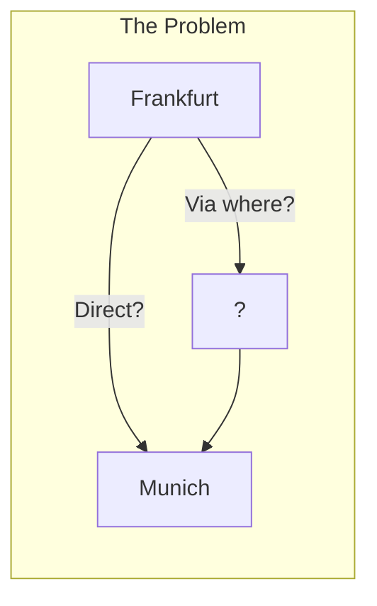
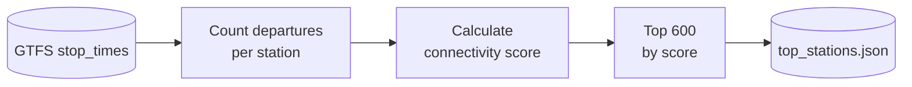
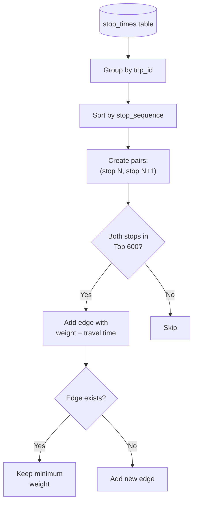
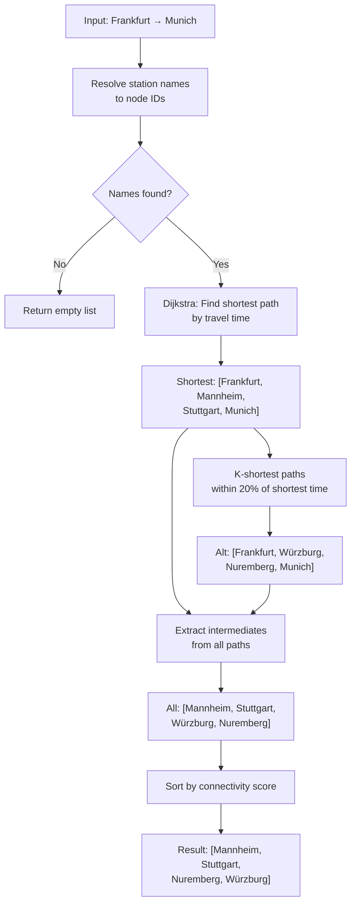
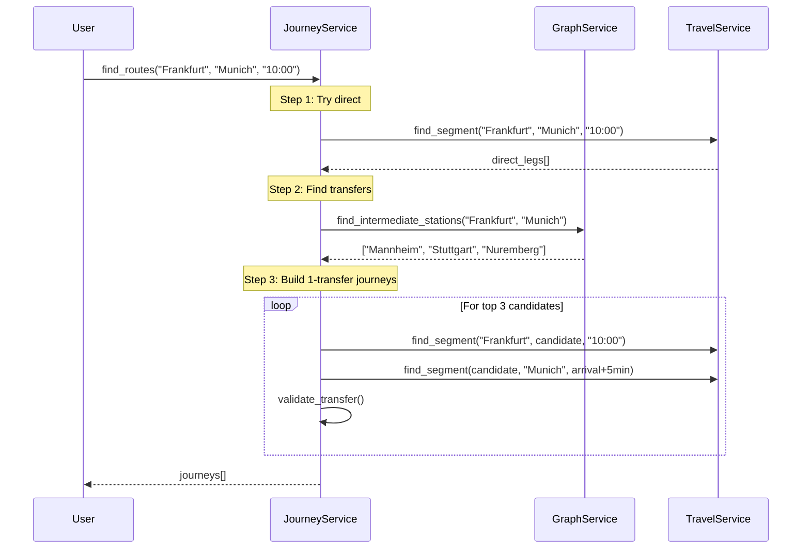

# Graph Traversal Service

> How we discover transfer stations and route candidates using a pre-computed connectivity graph.

## Concept Overview

Think of the German rail network as a web of stations connected by train lines. When a user asks "How do I get from Frankfurt to Munich?", we need to answer two questions:

1. **Is there a direct train?** (Easy - just query the schedule)
2. **Where should I transfer?** (Harder - requires network analysis)

The GraphService solves question #2 by maintaining a simplified "map" of the rail network and using pathfinding algorithms to suggest transfer stations.



**Why not query the full schedule?**
- GTFS has 500,000+ stop_times entries
- Finding all possible routes with transfers is computationally expensive
- We need a fast heuristic to narrow down candidates

---

## The Graph Structure

### Nodes: Top 600 Stations

Not all 5,000+ German train stations are useful for transfers. We pre-compute the "connectivity score" of each station and select the top ~600.

**Connectivity Score Formula:**
```
score = (number of departures) × (number of unique destinations)
```

This prioritizes major hubs like Frankfurt Hbf, Mannheim, and Cologne over small regional stops.

**Selection Process:**



**Storage:** `server/data/top_stations.json`
```json
[
  {"id": "8000105", "name": "Frankfurt (Main) Hbf", "score": 2847},
  {"id": "8000261", "name": "München Hbf", "score": 2156},
  ...
]
```

### Edges: Weighted Connections

An edge exists between two stations if there's at least one train that goes directly between them (consecutive stops on the same trip).

**Edge Attributes:**
- `weight`: Minimum travel time in minutes

**Edge Building Process:**



**Example:**
- Trip ICE 123 stops at: Frankfurt → Mannheim → Stuttgart → Munich
- Creates edges: `Frankfurt→Mannheim (18 min)`, `Mannheim→Stuttgart (38 min)`, `Stuttgart→Munich (127 min)`

### Graph Storage

The complete graph is cached as JSON for fast startup:

**File:** `server/data/graph_cache.json`

```json
{
  "nodes": [
    {"id": "8000105", "name": "Frankfurt (Main) Hbf", "pos": [8.66, 50.11], "score": 2847}
  ],
  "links": [
    {"source": "8000105", "target": "8000244", "weight": 18}
  ]
}
```

---

## Pathfinding Algorithm

The core algorithm answers: "Given origin and destination, what are good intermediate stations?"

### Step-by-Step Flow



### 1. Name Resolution

Station names are fuzzy-matched to graph nodes:

```python
def _find_node_by_name(self, name: str) -> Optional[str]:
    # Normalize: "Frankfurt Hbf" → "frankfurt hauptbahnhof"
    name_lower = name.lower().replace(" hbf", " hauptbahnhof")

    candidates = []
    for node, data in self.graph.nodes(data=True):
        if name_lower in data['name'].lower():
            candidates.append(node)

    # Pick the most connected candidate (avoids bus stops)
    return max(candidates, key=lambda n: self.graph.degree(n))
```

### 2. Shortest Path (Dijkstra)

Using NetworkX's weighted shortest path:

```python
shortest_path = nx.shortest_path(
    self.graph,
    origin_id,
    dest_id,
    weight='weight'  # Minimize travel time
)
# Result: ['8000105', '8000244', '8000096', '8000261']
# (Frankfurt → Mannheim → Stuttgart → Munich)
```

### 3. K-Shortest Paths

Find alternative routes within 20% of the optimal travel time:

```python
baseline_duration = nx.path_weight(graph, shortest_path, weight='weight')
max_duration = baseline_duration * 1.2  # 20% buffer

for path in nx.shortest_simple_paths(graph, origin, dest, weight='weight'):
    if path_weight(path) > max_duration:
        break  # Stop when paths get too slow
    intermediates.update(path[1:-1])  # Collect middle stations
```

**Why 20%?** Balances finding useful alternatives without suggesting unreasonable detours.

### 4. Score-Based Ranking

Intermediate stations are sorted by connectivity score to prioritize major hubs:

```python
results.sort(key=lambda x: x['score'], reverse=True)
return [r['name'] for r in results][:3]  # Return top 3
```

---

## Code Reference

**File:** `server/service/graph_service.py`

### Key Methods

| Method | Purpose | Line |
|--------|---------|------|
| `__init__()` | Initialize and load graph | 13-15 |
| `load_graph()` | Load from cache or rebuild | 20-35 |
| `build_graph()` | Build from GTFS data | 37-134 |
| `find_intermediate_stations()` | Main pathfinding logic | 172-246 |
| `_find_node_by_name()` | Fuzzy station name matching | 248-263 |

### Usage Example

```python
from server.service.graph_service import GraphService

graph = GraphService()  # Loads cached graph on init

# Find transfer candidates
intermediates = graph.find_intermediate_stations(
    "Frankfurt (Main) Hbf",
    "München Hbf"
)
# Returns: ["Mannheim Hbf", "Stuttgart Hbf", "Nürnberg Hbf"]
```

---

## How It's Used in the Pipeline

The GraphService is called by JourneyService when building 1-transfer connections:



---

## Limitations

| Limitation | Impact | Future Fix |
|------------|--------|------------|
| **Static topology** | Doesn't know *when* connections run | Implement CSA algorithm |
| **No time awareness** | May suggest impossible transfers | Time-expanded graph |
| **No platform info** | Can't calculate walking time | Integrate NeTEx pathways |
| **Top 600 only** | Small stations ignored | Dynamic station selection |
| **20% time buffer** | May miss good alternatives | Configurable threshold |

---

## Future Improvements

From [ROADMAP.md](../../ROADMAP.md):

1. **CSA (Connection Scan Algorithm)**: Time-dependent routing on the full timetable
2. **Raptor Algorithm**: Multi-criteria optimization (fastest vs fewest transfers)
3. **Platform-aware transfers**: Use NeTEx pathway data for realistic walking times
4. **Learning from history**: Weight edges by punctuality, not just travel time

---

## Performance Notes

- **Graph size**: ~600 nodes, ~15,000 edges
- **Load time**: ~50ms (from cache)
- **Pathfinding**: ~5-10ms per query
- **Memory**: ~2MB for graph object

The graph is small enough to keep entirely in memory, making pathfinding nearly instant.
