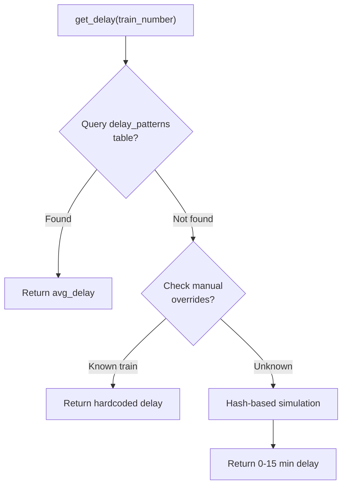
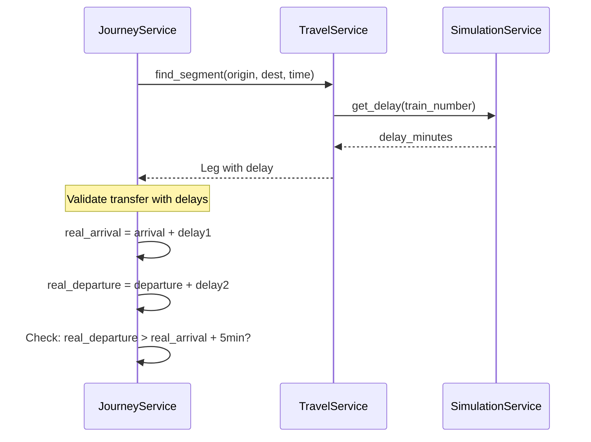
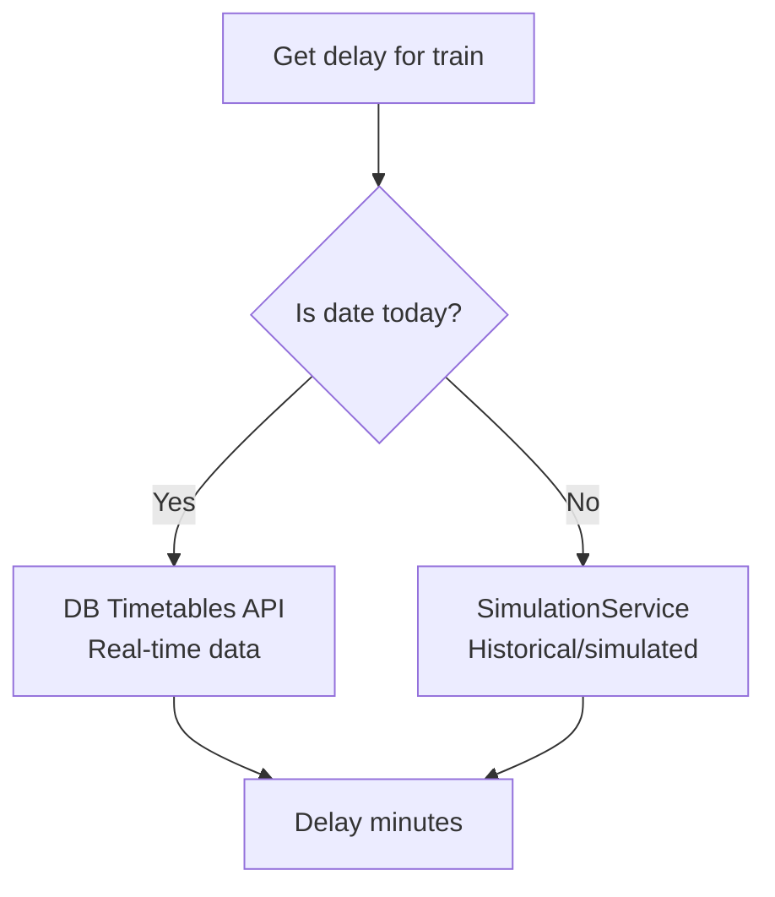

# Simulation Service

> How delays are calculated, simulated, and integrated into journey planning.

## Overview

The SimulationService provides delay information for train journeys. It uses a 3-tier fallback system:

1. **Historical database** - Query average delays from past data
2. **Manual overrides** - Hardcoded delays for demo trains
3. **Deterministic simulation** - Hash-based pseudo-random delays



---

## Service Location

**File:** `server/service/simulation.py`

---

## Delay Calculation

### Method: get_delay()

```python
def get_delay(
    train_number: str,
    station_name: str = None,
    hour: int = None
) -> int:
    """
    Returns delay in minutes using 3-tier fallback logic.

    Args:
        train_number: Train identifier (e.g., "690")
        station_name: Optional station for context-aware delay
        hour: Optional hour of day (0-23)

    Returns:
        Delay in minutes (int)
    """
```

### Tier 1: Historical Database

Queries the `delay_patterns` table for average historical delays:

```python
def get_historical_delay(train_number, station_name, hour) -> Optional[float]:
    query = """
        SELECT avg_delay FROM delay_patterns
        WHERE train_number = ?
          AND (station_name = ? OR station_name IS NULL)
          AND (hour_of_day = ? OR hour_of_day IS NULL)
        ORDER BY
            CASE WHEN station_name IS NOT NULL THEN 1 ELSE 2 END,
            CASE WHEN hour_of_day IS NOT NULL THEN 1 ELSE 2 END
        LIMIT 1
    """
    # Returns most specific match (station+hour > station > global)
```

**Table Schema:**
```sql
CREATE TABLE delay_patterns (
    train_number TEXT,
    station_name TEXT,
    hour_of_day INTEGER,
    avg_delay REAL,
    max_delay INTEGER,
    delay_count INTEGER
);
```

### Tier 2: Manual Overrides

Hardcoded delays for demo/testing purposes:

```python
MANUAL_DELAYS = {
    "690": 5,     # ICE 690: 5 min delay
    "82": 2,      # RB 82: 2 min delay
    "25169": 12,  # Special train: 12 min delay
}
```

### Tier 3: Deterministic Simulation

Hash-based pseudo-random delays for unknown trains:

```python
def _simulate_delay(train_number: str) -> int:
    h = hash(train_number)

    # 10% of trains have delays
    if h % 10 == 0:
        return (h % 15) + 1  # 1-15 minutes

    return 0  # No delay
```

**Properties:**
- Deterministic: Same train number always returns same delay
- Repeatable: Refreshing page shows consistent delays
- Realistic distribution: ~10% of trains delayed

---

## Wagon Load Simulation

### Method: get_load()

Simulates wagon occupancy percentages:

```python
def get_load(train_number: str) -> List[int]:
    """
    Returns list of occupancy percentages (0-100) for each wagon.

    Example: [45, 67, 82, 55, 43, 78, 90, 65]
    """
    h = hash(train_number)
    num_wagons = 5 + (h % 8)  # 5-12 wagons

    return [
        30 + ((h + i * 17) % 60)  # 30-90% occupancy
        for i in range(num_wagons)
    ]
```

---

## Integration with Journey Service

**Location:** `server/service/journey_service.py`

The simulation service is called during journey planning to add delay information:



### Delay Propagation Logic

```python
# In journey_service.py
def find_routes(origin, destination, time):
    for leg1 in leg1_options:
        for leg2 in leg2_options:
            # Get delays
            delay1 = leg1.delayInMinutes
            delay2 = leg2.delayInMinutes

            # Calculate real times
            real_arrival_l1 = arrival_dt + timedelta(minutes=delay1)
            real_departure_l2 = departure_dt + timedelta(minutes=delay2)

            # Check if transfer is still possible
            if real_departure_l2 < real_arrival_l1 + timedelta(minutes=5):
                continue  # Transfer broken by delay

            # Valid journey
            journeys.append(create_journey([leg1, leg2]))
```

---

## Live vs Simulated Decision

**Location:** `server/service/linker_service.py`

The system decides between live and simulated data based on the date:

```python
def get_trip_details(trip_id: str, date: datetime):
    is_today = date.date() == datetime.now().date()

    if is_today:
        # Use TimetableService for live data
        # Fetches from DB Timetables API
        return timetable_service.get_realtime(trip_id)
    else:
        # Use SimulationService for future dates
        delay = simulation.get_delay(train_number, station, hour)
        return add_simulated_delay(gtfs_data, delay)
```



---

## Data Sources

### Historical Delay Data (Planned)

**Location:** `datachaos/deutsche-bahn-data/`

Parquet files containing monthly delay statistics:

```
deutsche-bahn-data/
├── delay_statistics_2024_07.parquet
├── delay_statistics_2024_08.parquet
├── ...
└── delay_statistics_2025_11.parquet
```

**Columns:**
- `train_number` - Train identifier
- `station_name` - Station where delay measured
- `hour_of_day` - Hour (0-23)
- `avg_delay` - Average delay in minutes
- `max_delay` - Maximum observed delay
- `delay_count` - Number of observations

**Status:** Data available but not yet ingested into database.

### SIRI Real-Time Feed (Reference)

**Location:** `datachaos/message.txt`

Historical SIRI messages that can be parsed for delay patterns.

---

## Configuration

No external configuration required. All settings are hardcoded in the service.

**Tunable Constants:**
```python
# In simulation.py
DELAY_PROBABILITY = 0.1      # 10% of trains delayed
MAX_SIMULATED_DELAY = 15     # Maximum delay in minutes
MIN_WAGONS = 5               # Minimum wagon count
MAX_WAGONS = 12              # Maximum wagon count
```

---

## Key Files

| File | Purpose |
|------|---------|
| `server/service/simulation.py` | SimulationService implementation |
| `server/service/journey_service.py` | Delay propagation in routing |
| `server/service/linker_service.py` | Live vs simulated decision |
| `server/service/travel_service.py` | Integrates delays into legs |
| `server/data/travel.db` | delay_patterns table |

---

## Future Improvements

From [ROADMAP.md](../../ROADMAP.md):

1. **Historical data ingestion** - Import Parquet files into delay_patterns table
2. **ML-based prediction** - Train model on historical patterns
3. **Weather integration** - Factor in weather for delay prediction
4. **Route-specific delays** - Consider delay propagation along routes
5. **Confidence intervals** - Return delay range, not just average
