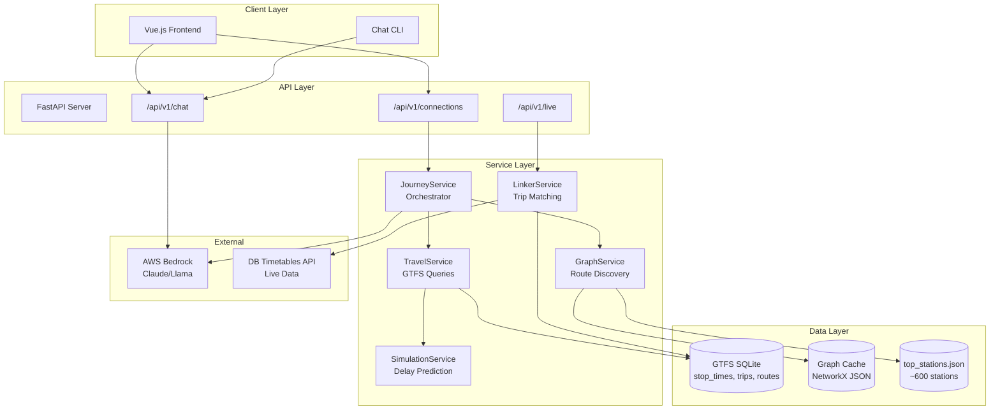

# Smart Travel Assistant - System Architecture

> A conversational travel planner for the German rail network, combining static GTFS data, live DB API data, and AI-powered insights.

## Overview

The Smart Travel Assistant is a hackathon project that enables users to plan train journeys through natural conversation. The system uses a **3-step pipeline** (Discover → Retrieve → Evaluate) to find connections, combining a pre-computed station graph with real-time train data and AI-generated insights.

**Key Capabilities:**
- Chat-first journey planning with AI intent understanding
- Multi-leg routing with transfer validation
- Delay simulation and propagation
- Accessibility awareness (step-free access, platforms)

---

## System Architecture



---

## Core Components

### 1. JourneyService (Orchestrator)

**Location:** `server/service/journey_service.py`

The central coordinator that implements the 3-step pipeline:

1. **Direct connections** - Find trains that go from A to B directly
2. **1-transfer connections** - Use GraphService to find intermediate stations, then chain two legs
3. **Delay propagation** - Adjust arrival times based on delays, validate transfers still work
4. **AI insight** - Generate human-readable summary via Bedrock

### 2. GraphService (Route Discovery)

**Location:** `server/service/graph_service.py`

Pre-computed connectivity graph of ~600 major German train stations. Uses NetworkX for pathfinding.

**See:** [Graph Traversal Service Deep Dive](./graph-traversal-service.md)

### 3. TravelService (GTFS Queries)

**Location:** `server/service/travel_service.py`

Queries the SQLite database containing GTFS data (stop_times, trips, routes) to find actual train legs with departure/arrival times.

### 4. SimulationService (Delay Prediction)

**Location:** `server/service/simulation.py`

Provides delay information:
- **Today**: Attempts to use live DB API data
- **Future dates**: Uses deterministic simulation based on train number hash

### 5. LinkerService (Trip Matching)

**Location:** `server/service/linker_service.py`

Links train numbers (e.g., "ICE 690") to GTFS trip IDs using a multi-level matching strategy:
1. Strict: Train number + category + time (±5 min)
2. Fuzzy: Train number + time (±60 min)
3. Spatial: Verify the trip actually stops at the station

---

## The 3-Step Pipeline

```mermaid
flowchart LR
    subgraph "Step 1: DISCOVER"
        direction TB
        Input1[Origin + Destination] --> GS1[GraphService]
        GS1 --> |"Dijkstra + k-shortest"| Path["[Frankfurt, Mannheim, Stuttgart, Munich]"]
    end

    subgraph "Step 2: RETRIEVE"
        direction TB
        Path --> Segments["Segment: Frankfurt → Mannheim<br/>Segment: Mannheim → Munich"]
        Segments --> TS1[TravelService]
        TS1 --> |"SQL Query"| Legs["Leg 1: ICE 123 @ 10:00<br/>Leg 2: ICE 456 @ 11:30"]
        TS1 --> SS1[SimulationService]
        SS1 --> |"Add delays"| Legs
    end

    subgraph "Step 3: EVALUATE"
        direction TB
        Legs --> Val["Validate Transfer<br/>(arrival + 5min < departure)"]
        Val --> Journey["Journey Object"]
        Journey --> AI[Bedrock AI]
        AI --> |"Generate insight"| Final["Final Journey<br/>with aiInsight"]
    end
```



### Step 1: Discover Intermediate Stations

The GraphService finds a logical path of major stations using a pre-computed graph:

- **Input**: "Frankfurt" → "Munich"
- **Process**: Dijkstra shortest path + alternatives within 20% time
- **Output**: `["Mannheim", "Stuttgart"]` (candidate transfer points)

### Step 2: Retrieve Train Data

For each segment, TravelService queries GTFS to find actual trains:

```sql
SELECT * FROM stop_times s1
JOIN stop_times s2 ON s1.trip_id = s2.trip_id
WHERE s1.stop_id = 'Frankfurt'
  AND s2.stop_id = 'Mannheim'
  AND s1.stop_sequence < s2.stop_sequence
  AND s1.departure_time >= '10:00'
ORDER BY departure_time LIMIT 10
```

SimulationService adds delay information to each leg.

### Step 3: Evaluate & Validate

JourneyService stitches legs together and validates transfers:

- **Transfer buffer**: Minimum 5 minutes between arrival and departure
- **Delay propagation**: If leg 1 is delayed, check if leg 2 is still reachable
- **AI insight**: Bedrock generates a summary like "Direct ICE, typically punctual"

---

## Data Sources

| Source | Type | Content | Usage |
|--------|------|---------|-------|
| GTFS (SQLite) | Static | Schedules, stops, routes | TravelService queries |
| NeTEx | Static | Accessibility, platforms | Station info enrichment |
| DB Timetables API | Live | Real-time delays, platforms | LinkerService (today only) |
| AWS Bedrock | Live | AI/LLM responses | Chat and journey insights |
| top_stations.json | Computed | Top 600 stations by connectivity | GraphService nodes |
| graph_cache.json | Computed | NetworkX graph as JSON | GraphService pathfinding |

**See:** [Data Sources](./data-sources.md) for complete details on databases, APIs, and configuration

---

## API Endpoints

| Endpoint | Method | Purpose |
|----------|--------|---------|
| `/api/v1/connections` | POST | Find journeys (main endpoint) |
| `/api/v1/chat` | POST | Conversational planning |
| `/api/v1/live/{station}` | GET | Live departures |
| `/api/v1/stations` | GET | Station list |
| `/api/v1/status` | GET | System health |

**See:** [API Reference](../api/api-reference.md)

---

## Key Design Decisions

| Decision | Rationale |
|----------|-----------|
| **Chat-First Flow** | Complex intent understanding before database queries |
| **Service-First + AI-Last** | AI at boundaries only (intent, insights) - predictable, fast, cheaper |
| **Static Graph** | Pre-computed connectivity is fast enough for MVP; full CSA/Raptor deferred |
| **Top 600 Stations** | Performance vs coverage tradeoff; covers major hubs |
| **5-min Transfer Buffer** | Conservative default; platform-aware logic is future work |

**See:** [Architecture Decisions](./architecture-decisions.md)

---

## Current Limitations

1. **Not time-dependent**: Graph knows "Frankfurt connects to Mannheim" but not *when*
2. **No calendar filtering**: Assumes all trains run daily (missing calendar.txt data)
3. **Basic delay simulation**: Deterministic hash-based, not ML-powered
4. **No platform awareness**: All transfers use fixed 5-minute buffer
5. **1-transfer max**: 2+ transfer connections not implemented

**See:** [Roadmap](../../ROADMAP.md) for planned improvements
