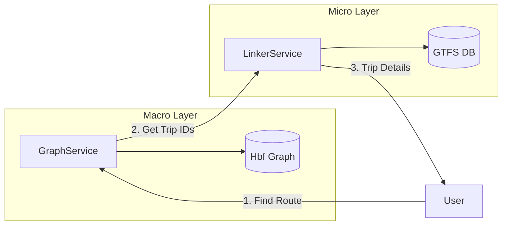
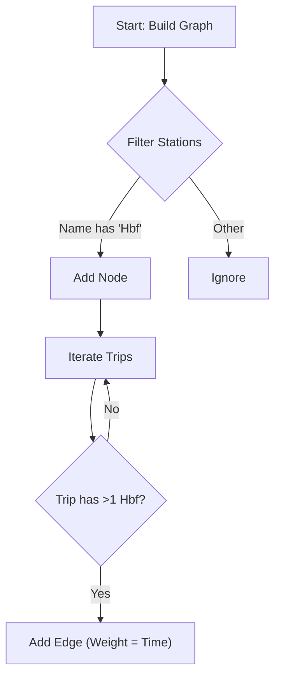
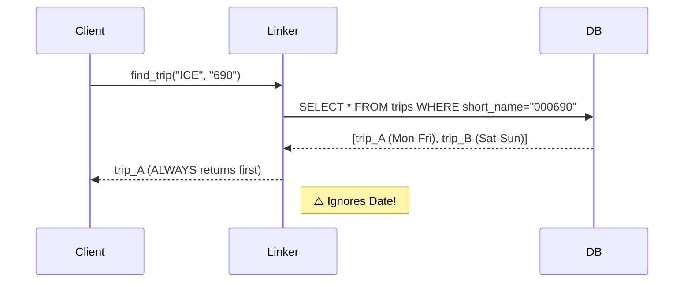

# Analysis & Recommendations: GraphService and Matching Algorithm

## 1. Current System Analysis

### Architecture Overview

The current system splits responsibilities between a "Macro" router (`GraphService`) and a "Micro" detail fetcher (`LinkerService`).



### Component Breakdown

#### A. GraphService (The Router)
*   **Logic**: Builds a simplified network graph of major stations.
*   **Heuristic**: Filters stations where name contains "Hbf" or "Hauptbahnhof".
*   **Pathfinding**: Uses Dijkstra (shortest time) and simple path (fewest hops) algorithms.
*   **Station Resolution**: Fuzzy matches names and selects the node with the highest degree (most connections) to avoid disconnected platforms.



#### B. LinkerService (The Matcher)
*   **Logic**: Links abstract train numbers (e.g., "ICE 690") to specific GTFS `trip_id`s.
*   **Matching**: Queries `trips` table by `trip_short_name`.
*   **Limitation**: Returns the *first* match found, ignoring service dates.



## 2. Reliability Assessment

### ✅ Strengths
1.  **Performance**: The "Hbf-only" graph is small (~1,100 nodes) and extremely fast for routing.
2.  **Robust Resolution**: The "highest degree" logic effectively filters out noise (e.g., bus stops with similar names).
3.  **Simplicity**: The architecture is easy to understand and extend.

### ⚠️ Critical Gaps
1.  **Missing Calendar Data**: The database **lacks** `calendar` and `calendar_dates` tables. We cannot determine which days a train actually runs.
2.  **Date Ignorance**: `LinkerService` will return a `trip_id` even if that specific trip doesn't run on the requested date. This leads to "ghost trains" in the UI.
3.  **Missing Major Stations**: Important hubs like *Berlin Ostbahnhof* or *Hamburg-Altona* are excluded because they don't have "Hbf" in their name.

## 3. Recommendations for Hackathon MVP

### Question: "Do we have data or should we simulate?"
**Answer: We MUST simulate.**
We verified the database schema and the `calendar` tables are missing. We have `service_id` in the `trips` table, but no way to map it to dates.

### Simulation Strategy
Since we cannot fix the data in time, we should implement a **Deterministic Simulation**:

1.  **Assume Daily Service**: For the MVP, treat all trips as running every day. This ensures the demo always works.
2.  **Simulate "Live" Status**:
    *   Use a hash of `(trip_id + date)` to generate deterministic "delays".
    *   *Example*: `hash("trip_123_2024-12-06") % 10` could result in a 3-minute delay.
    *   This makes the demo feel "live" and consistent (refreshing the page shows the same "delay").

### Proposed Fixes
1.  **GraphService**: Add a whitelist of ~20 major non-Hbf stations to the graph builder.
2.  **LinkerService**: Update `find_trip_id` to accept a date, but use it only for the "simulation" seed, returning the first available `trip_id` as a fallback.

```python
# Proposed Simulation Logic
def is_trip_running(trip_id, date):
    # MVP: Assume EVERYTHING runs
    return True

def get_delay(trip_id, date):
    # 1. Try Live Data (if date is today)
    if is_today(date):
        live_delay = TimetableService.get_delay(trip_id)
        if live_delay is not None:
            return live_delay

    # 2. Fallback: Deterministic Simulation
    seed = f"{trip_id}_{date}"
    return hash(seed) % 15  # 0-14 min random delay
```

## 4. Evaluated Idea: Hybrid Live/Simulated Model

You asked: *"Can we use live data to simulate?"*

**Evaluation:**
*   **Live Data (Now)**: We **DO** have a working `TimetableService` that fetches real-time delays from DB API. We should use this for any query within the next ~2 hours.
*   **Historical Data (Future)**: We **DO NOT** have a database of past delays to "learn" from. We cannot predict that "ICE 690 usually has 10min delay on Fridays" without collecting data first.
*   **Recommendation**: Use a **Hybrid Approach**.
    *   **If `date` == Today**: Call `TimetableService` (Real API). The user sees *actual* delays.
    *   **If `date` == Future**: Use **Data-Driven Simulation**. We will ingest the `piebro/deutsche-bahn-data` dataset to learn delay patterns (e.g., "ICE 690 usually has 5min delay on Fridays") and apply them.

## 5. Research: Scraping & Historical Data

You asked: *"Can we scrape bahn.expert?"*

**Findings:**
1.  **Legal/Technical Risk**: `bahn.expert` (and DB) have strict terms against scraping.
2.  **Open Datasets**: `piebro/deutsche-bahn-data` is a goldmine. It contains historical delays.
3.  **Conclusion for MVP**:
    *   **Use the Dataset**: We will download this data and preprocess it.
    *   **Preprocessing Strategy**: Instead of querying raw CSVs in real-time, we will aggregate them into a `delay_patterns` table (Route + Hour + Day -> Avg Delay). This makes the simulation fast and statistically grounded.

## 6. Next Steps (Implementation Plan)

1.  **Modify `LinkerService`**:
    *   Add `date` parameter to `find_trip_id`.
    *   Implement the **Hybrid Logic**:
        *   If `date` is today: Fetch live data.
        *   If `date` is future: Return deterministic simulation.

2.  **Modify `GraphService`**:
    *   Add whitelist of major non-Hbf stations (e.g., *Berlin Ostbahnhof*, *Hamburg-Altona*).
    *   Rebuild graph to include these critical nodes.

3.  **Update `ConnectionsService`**:
    *   Wire it all together to return the full `Journey` model.

