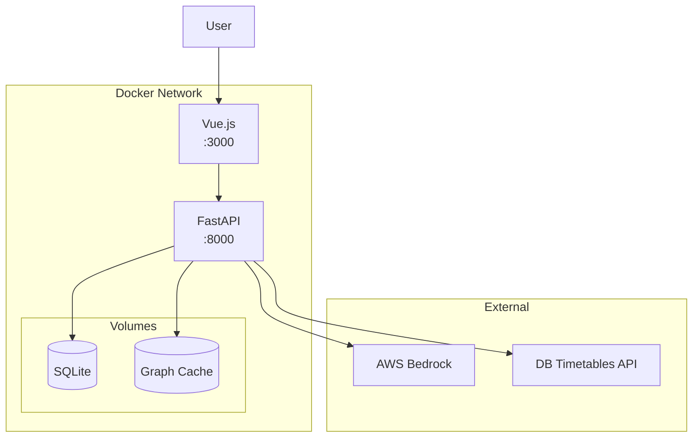

# Deployment Guide

> Deploy the Smart Travel Assistant using Docker.

## Docker Compose

The project includes a `compose.yaml` for easy deployment.

### Services

| Service | Port | Description |
|---------|------|-------------|
| `server` | 8000 | FastAPI backend |
| `client` | 3000 | Vue.js frontend (dev server) |

### Quick Start

```bash
# Build and start
docker compose up --build

# Start in background
docker compose up -d

# View logs
docker compose logs -f server

# Stop
docker compose down
```

---

## Environment Configuration

### Required Variables

Create `server/.env`:

```bash
# DB Timetables API
TROY_API_CLIENT=your_client_id
TROY_API_KEY=your_api_key

# AWS Bedrock
AWS_ACCESS_KEY=your_access_key
AWS_SECRET=your_secret_key
AWS_REGION=eu-central-1
```

### Optional Variables

```bash
# Fallback API credentials
LARS_API_CLIENT=backup_client_id
LARS_API_KEY=backup_api_key

# Short-term bearer token (alternative to long-term keys)
AWS_SHORT_TERM_KEY=your_bearer_token
```

---

## Container Details

### Server Container

**Dockerfile:** `server/Dockerfile`

```dockerfile
FROM python:3.9-slim
WORKDIR /app
COPY requirements.txt .
RUN pip install -r requirements.txt
COPY . .
CMD ["uvicorn", "main:app", "--host", "0.0.0.0", "--port", "8000"]
```

**Volumes:**
- `./server:/app/server` - Live code reload

### Client Container

**Dockerfile:** `client/Dockerfile`

```dockerfile
FROM node:18-alpine
WORKDIR /app
COPY package*.json .
RUN npm install
COPY . .
CMD ["npm", "run", "dev", "--", "--host", "0.0.0.0"]
```

**Volumes:**
- `./client:/app` - Live code reload
- `/app/node_modules` - Preserve installed modules

---

## Data Persistence

### SQLite Database

The GTFS database is stored at `server/data/travel.db`.

To persist across container restarts:
```yaml
# In compose.yaml
services:
  server:
    volumes:
      - ./server/data:/app/server/data
```

### Graph Cache

Pre-computed graph at `server/data/graph_cache.json`:
- Loaded on startup (~50ms)
- Rebuilt if missing (~2-3 min)

---

## Production Considerations

### 1. Use Production WSGI Server

Replace the dev server with Gunicorn:

```dockerfile
CMD ["gunicorn", "main:app", "-w", "4", "-k", "uvicorn.workers.UvicornWorker", "-b", "0.0.0.0:8000"]
```

### 2. Build Frontend for Production

```yaml
services:
  client:
    command: ["npm", "run", "build"]
    # Then serve with nginx
```

### 3. Add Health Checks

```yaml
services:
  server:
    healthcheck:
      test: ["CMD", "curl", "-f", "http://localhost:8000/api/v1/status"]
      interval: 30s
      timeout: 10s
      retries: 3
```

### 4. Resource Limits

```yaml
services:
  server:
    deploy:
      resources:
        limits:
          cpus: '2'
          memory: 2G
```

### 5. Logging

```yaml
services:
  server:
    logging:
      driver: "json-file"
      options:
        max-size: "10m"
        max-file: "3"
```

---

## Scaling

### Horizontal Scaling

The server is stateless (except in-memory sessions). For horizontal scaling:

1. **Session Storage**: Move to Redis
2. **Load Balancer**: nginx or cloud LB
3. **Database**: SQLite → PostgreSQL for concurrent writes

### Example with Redis

```yaml
services:
  redis:
    image: redis:alpine
    ports:
      - 6379:6379

  server:
    environment:
      - REDIS_URL=redis://redis:6379
    depends_on:
      - redis
```

---

## Monitoring

### Basic Metrics

The `/api/v1/status` endpoint returns:
```json
{
  "status": "healthy",
  "version": "1.0.0"
}
```

### Prometheus (Future)

Add metrics endpoint:
```python
from prometheus_fastapi_instrumentator import Instrumentator
Instrumentator().instrument(app).expose(app)
```

---

## Troubleshooting

### Container won't start

Check logs:
```bash
docker compose logs server
```

Common issues:
- Missing `.env` file
- Port 8000 already in use
- Missing dependencies

### Database not found

Ensure data directory is mounted:
```bash
ls -la server/data/
# Should show travel.db, graph_cache.json, top_stations.json
```

### AI features not working

Verify AWS credentials:
```bash
docker compose exec server env | grep AWS
```

---

## Architecture Diagram


