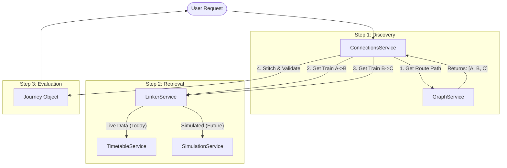
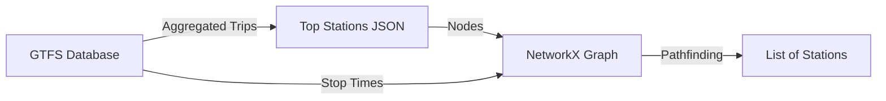
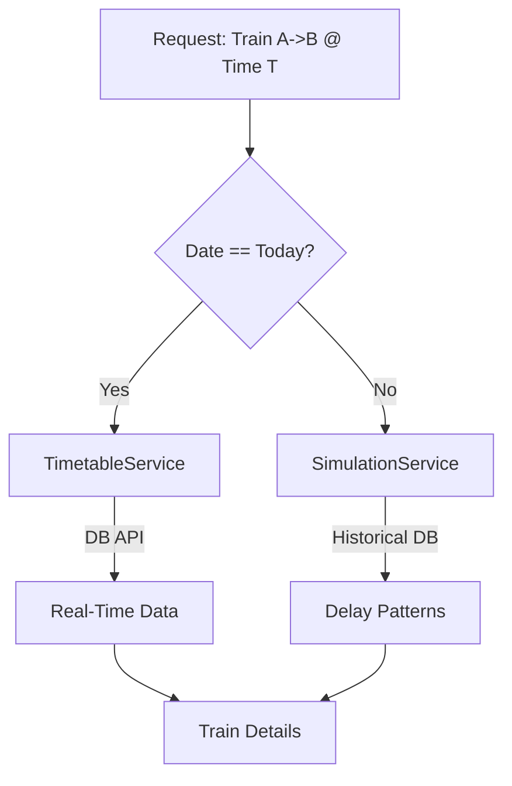

# Hybrid Service Architecture

This document explains the architecture of the new "Hybrid" connection service, which combines a static connectivity graph with dynamic train lookup.

## High-Level Overview

The system is composed of three main services that work in a pipeline to answer the question: *"How do I get from A to B?"*

---

## Step 1: Discover Intermediate Stations (`GraphService`)

**Goal**: Find a logical path of major stations (hubs) between the origin and destination.

### How it works
1.  **Pre-computation**: We calculate the "Connectivity Score" of all stations in the GTFS data (aggregated by parent station) and select the top ~600.
2.  **Graph Build**: We build a directed graph where nodes are these top stations. Edges are created if a trip exists between them, weighted by travel time.
3.  **Pathfinding**: At runtime, we use Dijkstra (shortest path) and simple path algorithms to find sequences of stations (e.g., `Frankfurt -> Mannheim -> Stuttgart -> München`).

### What is Missing?
*   **Time-Dependent Routing**: The current graph is static. It knows "Frankfurt connects to Mannheim," but it doesn't know *when*. It assumes a connection is always possible.
*   **Real Routing Algorithm**: We are using simple shortest paths. A production system would use **CSA (Connection Scan Algorithm)** or **Raptor** to explore the actual timetable graph, not just the topological graph.
*   **Platform Awareness**: The graph nodes are aggregated stations (parent IDs). We lose specific platform transfer information at this stage.

---

## Step 2: Get All Planned Trains (`LinkerService`)

**Goal**: Find actual trains (trips) that serve the segments identified in Step 1.

### How it works
The `LinkerService` acts as a facade that decides *where* to get data based on the requested date.

*   **Scenario A: Today (Live)**
    *   Queries `TimetableService` (DB API) for real-time departures.
    *   Matches the route segment (e.g., "Departing Frankfurt towards Mannheim").
*   **Scenario B: Future (Simulation)**
    *   Queries `SimulationService` (Historical Data).
    *   Predicts delays based on historical patterns (e.g., "ICE 100 usually has 5min delay on Fridays").

### What is Missing?
*   **Segment Lookup**: Currently, `LinkerService` is optimized for "Find details of Train X". It lacks a robust "Find *any* train from A to B at Time T" method. We are currently mocking this in `ConnectionsService`.
*   **Data-Driven Simulation**: We have the infrastructure (SQLite), but we haven't imported the `piebro/deutsche-bahn-data` yet. The simulation is currently random/hardcoded.
*   **Train Composition**: We are not yet fetching wagon sequences or accessibility info for the found trains.

---

## Step 3: Calculate / Evaluate Journeys (`ConnectionsService`)

**Goal**: Stitch the trains into a valid journey and validate transfers.

### How it works
1.  Receives the list of stations from Step 1.
2.  Iterates through segments (Station i -> Station i+1).
3.  Calls Step 2 to find a train for each segment.
4.  Constructs the `Journey` object with `Train` and `Station` models.

### What is Missing?
*   **Transfer Validation**: We are simply stitching Train A and Train B. We are **not** checking if the transfer time (Arrival of A vs. Departure of B) is sufficient (e.g., "Min 5 minutes").
*   **Optimization**: We return the first valid path. We should evaluate multiple paths (e.g., "Fastest", "Fewest Transfers") and rank them.
*   **Platform Logic**: We need to check if a transfer requires a platform change (e.g., Track 1 to Track 10) and adjust the required transfer time accordingly.

---

## Summary of Next Steps

| Step | Component | Action Required |
| :--- | :--- | :--- |
| **1. Discover** | `GraphService` | Keep as-is for Hackathon. (CSA is too complex for now). |
| **2. Retrieval** | `LinkerService` | **CRITICAL**: Implement `find_trips(origin, dest, time)` using GTFS data. Integrate historical delay data. |
| **3. Evaluate** | `ConnectionsService` | Implement `validate_transfer(arrival, departure)` logic. |
